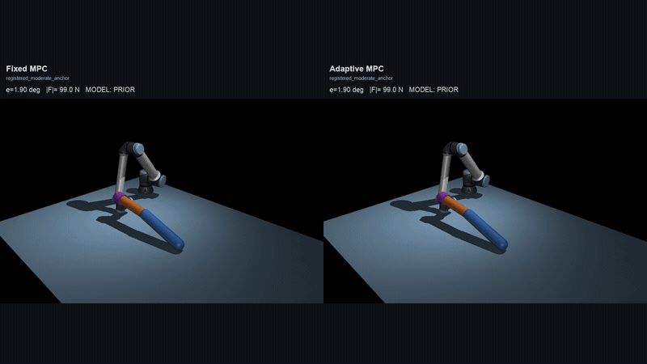
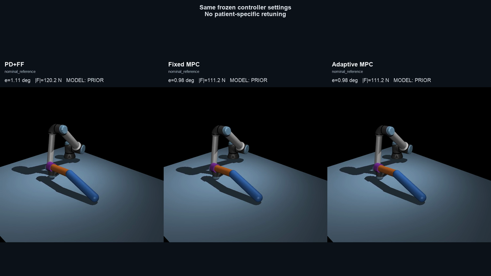
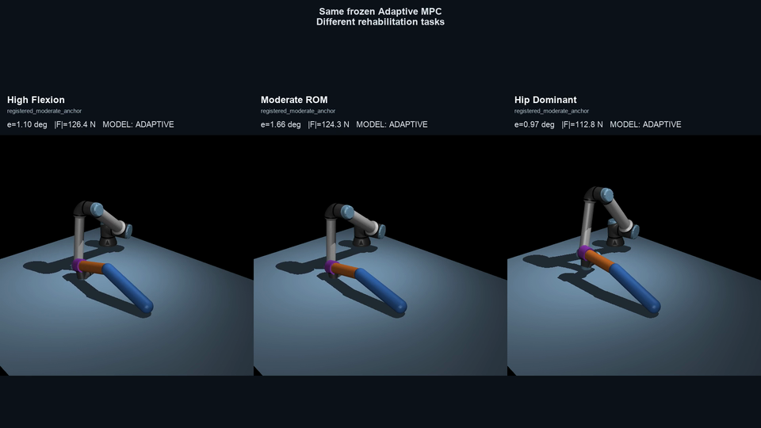

# Adaptive Traction MPC for Lower-Limb Rehabilitation

Adaptive Traction MPC is a simulation research platform for robot-assisted
lower-limb motion under uncertain Human dynamics. It combines a rigid-cuff
human–robot model, causal effective-dynamics estimation, trust-gated model
promotion, and constrained model-predictive control. The current system is a
simulation-qualified prototype preparing for robot-side commissioning—not a
clinical or production system.

## Overview

The project asks whether natural rehabilitation motion can identify enough of
a patient's control-effective dynamics to improve tracking without hidden
calibration motion or direct access to simulator truth. Stage 3 supplies the
coupled 3D UR10e-surrogate/Human-V2 plant. Stage 4 consumes only robot-facing
state, cuff pose/twist, and reconstructed wrench measurements.

## Method

```text
Rigid cuff mechanics
  → 11-term effective-dynamics estimator
  → embargoed incumbent/challenger trust checks
  → constrained Human-space MPC
  → robot torque interface
```

The online model is control-effective, not an anatomical parameter estimate.
Until a challenger passes causal future-block validation, the population prior
remains in control. The retained allocator and safety/actuator gates are shared
across fixed and adaptive MPC.

## Key results

- All 36 preregistered patient-generalization arms completed with finite
  artifacts, full reference progress, and no recorded safety-gate event.
- Fixed MPC had lower measured acceleration and jerk than PD+feedforward in
  all 12 matched comparisons.
- Adaptive MPC improved or tied Fixed MPC tracking RMSE in all 12 matched
  comparisons; load and effort changes were mixed, so this is not a universal
  superiority claim.
- Peak cuff force in the 36-arm study remained below the 200 N engineering
  gate. This is not a comfort, tissue-load, or clinical-safety result.
- Saved-trace desktop replay measured 9.42 ms mean MPC time and 16.52 ms mean
  full-cycle time (about 60.5 Hz); this is not a hard-realtime guarantee.

Detailed claims, hashes, and limitations are in the
[Stage-4 evidence map](stages/stage4_adaptive_control/docs/research/STAGE4_EVIDENCE_MAP.md)
and [report-validation evidence map](stages/stage4_adaptive_control/docs/research/STAGE4_REPORT_VALIDATION_EVIDENCE_MAP.md).

## Demos

### Fixed MPC vs Adaptive MPC



Synchronized real MuJoCo replay from frozen traces; no controller rollout or
new simulation was performed to create this README media.

### Patient Generalization



The same frozen controller settings are used across the shown patient
variations without patient-specific retuning.

### Trajectory Generalization



The same frozen Adaptive MPC is replayed across different rehabilitation
trajectories.

## Repository structure

```text
stages/
├── stage1/                    point-force Spring2D foundation
├── stage2_linkage/            planar Human V2 and rigid cuff
├── stage3_full3d/             coupled 3D plant and robot interfaces
└── stage4_adaptive_control/   estimator, trust, MPC, validation, evidence
```

Stage 4 imports Stage 3 simulation APIs explicitly; it does not duplicate the
plant. See the [Stage-4 guide](stages/stage4_adaptive_control/README.md) for its
code, configs, tests, evidence hierarchy, and canonical commands.

## Setup and validation

The recorded environment is named `mpc_learn`. From the repository root:

```bash
conda run -n mpc_learn python -m pip install -e "stages/stage3_full3d[dev]"
conda run -n mpc_learn python -m pip install -e "stages/stage4_adaptive_control[dev]"

PYTHONPATH=stages/stage4_adaptive_control/src:stages/stage3_full3d/src:stages/stage4_adaptive_control \
  conda run -n mpc_learn pytest -q stages/stage4_adaptive_control/tests
```

Formal scientific runs are user-executed only and must use a new output
directory. Repository validation never reruns or overwrites frozen evidence.
Exact experiment commands live in the approved specs under
[`stages/stage4_adaptive_control/docs/research/`](stages/stage4_adaptive_control/docs/research/).

## Limitations and status

- Simulation-only evidence, mostly within the representable Human-V2 family.
- UR10e is a surrogate; CR12 command, timing, calibration, and emergency-stop
  behavior remain unvalidated.
- The cuff surface-load quantity is a mathematical proxy, not pressure,
  comfort, tissue loading, injury risk, or clinical safety.
- Desktop replay timing is not target-hardware or worst-case real-time proof.
- No clinical efficacy, certification, or production claim is made.

Stage 4 is scientifically closed for this checkpoint. The next phase is
robot-only commissioning and hardware safety-interface validation.
