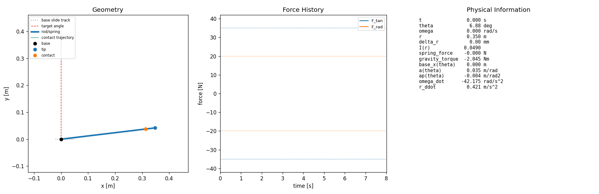
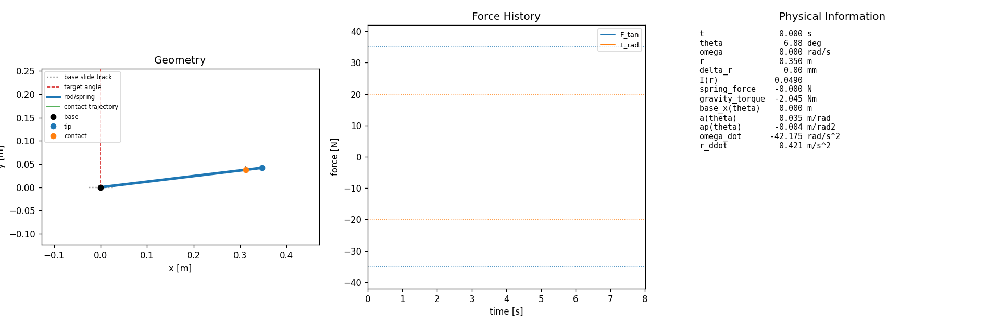

# Stage 1 Spring2D Adaptive MPC Report

## 1. Overview

This stage studies a simplified 2D Spring2D traction environment before moving to MuJoCo or hardware. The object is represented as a moving-base polar spring/elastic rod in a vertical 2D plane.

The local force input is:

```text
u = [F_tan, F_rad]
```

where `F_tan` is tangential force and `F_rad` is radial/contact force. The experiment compares:

- fixed true-parameter MPC
- fixed mismatched MPC with identifier logging only
- adaptive MPC using online parameter estimates

Observation conditions:

- `clean`: no observation noise or bias
- `noise`: Gaussian observation noise
- `noise_bias`: Gaussian observation noise plus constant bias

## 2. Mathematical Formulation

### 2.1 Pipeline

The current Stage 1 pipeline is:

```text
Spring2D dynamics
  -> observation wrapper
  -> Windowed NLS identifier
  -> fixed/adaptive MPC
  -> local force action
```

The environment provides the Spring2D state and physical response. The observation wrapper optionally adds measurement noise and bias. The Windowed NLS identifier estimates task-relevant prediction parameters from recent transitions. Fixed MPC uses fixed model parameters, while adaptive MPC updates its prediction parameters online. The final control command is the local contact-force action.

### 2.2 State, Action, and Observation

State:

```text
x = [theta, omega, r, r_dot]^T
```

Action:

```text
u = [F_tan, F_rad]^T
```

Observation:

```text
y = x + noise + bias
```

`F_tan` and `F_rad` are local tangential and radial contact-force components. They are not separate physical actuators; they are the resolved local force components applied at the contact point in the Spring2D model.

### 2.3 Dynamics and Prediction Model

The compact continuous-time model is written as:

$$
\dot{x} = f(x, u; \theta_p), \qquad
\theta_p = [m, k, b_r]^T
$$

The discrete prediction model used by MPC and identification is:

$$
x_{k+1} = \Phi_{\Delta t}(x_k, u_k; \theta_p)
$$

Gravity is inside the Spring2D dynamics. There is no explicit gravity compensation outside the model.

### 2.4 Windowed NLS Identifier

The online identifier estimates task-relevant effective parameters:

$$
\theta_p = [m, k, b_r]^T
$$

At update time, it solves a windowed nonlinear least-squares problem:

$$
\hat{\theta}_t =
\arg\min_{\theta \in \mathcal{B}}
\sum_i
\left\lVert
y_{i+1} - \Phi_{\Delta t}(y_i, u_i; \theta)
\right\rVert_W^2
+ \lambda
\left\lVert
\theta - \hat{\theta}_{t-1}
\right\rVert^2
$$

These estimates are used for MPC prediction. They should be interpreted as task-relevant effective parameters, not guaranteed recovery of true physical parameters under noisy or biased observations.

### 2.5 MPC Formulation

The fixed and adaptive controllers solve an approximate nonlinear MPC problem:

$$
\begin{aligned}
\min_{u_{0:H-1}} \quad
& \sum_{k=0}^{H-1} \ell(x_k, u_k) + \ell_T(x_H) \\
\text{s.t.} \quad
& x_{k+1} = \Phi_{\Delta t}(x_k, u_k; \hat{\theta})
\end{aligned}
$$

For fixed true-parameter MPC, `theta_hat` is the known model parameter set. For fixed mismatched MPC, `theta_hat` remains the initial mismatched model. For adaptive MPC, `theta_hat` is updated online using the identifier output.

Shared stage cost:

$$
\ell =
w_\theta(\theta - \theta_g)^2
+ w_{\Delta r}\Delta r^2
+ w_{F_{\mathrm{tan}}}F_{\mathrm{tan}}^2
+ w_{F_{\mathrm{rad}}}F_{\mathrm{rad}}^2
+ w_\alpha \alpha^2
- w_{\omega,\mathrm{progress}}\omega
$$

Terminal cost:

$$
\ell_T = w_{\mathrm{terminal},\theta}(\theta_H - \theta_g)^2
$$

Definitions:

$$
\alpha = \frac{\omega_{\mathrm{next}} - \omega}{\Delta t},
\qquad
\Delta r = r - L_0
$$

### 2.6 Shared Constraints

All fixed and adaptive MPC runs use the same shared base constraints:

$$
\begin{aligned}
|F_{\mathrm{rad}}| &\le F_{\mathrm{rad,max}} \\
|F_{\mathrm{tan}}| &\le F_{\mathrm{tan,max}} \\
|\Delta r| &\le \Delta r_{\max} \\
|\omega| &\le \omega_{\max} \\
|\alpha| &\le \alpha_{\max}
\end{aligned}
$$

Both `F_rad` and `delta_r` are retained. `F_rad` represents interaction/contact safety, while `delta_r` represents object/state deformation safety.

### 2.7 Random Shooting Solver

The current MPC solver is random shooting:

- sample candidate control sequences
- roll each candidate through the nonlinear prediction model
- evaluate the objective and constraint penalties
- select the best sampled sequence
- execute only the first action

This is derivative-free approximate NMPC. It is not a strict constrained QP/NLP solver. As a result, selected trajectories can still be infeasible under strict `omega` and `alpha` constraints.

### 2.8 Compared Controllers

The Stage 1 comparison includes:

- fixed true-parameter MPC
- fixed mismatched MPC with identifier logging only
- adaptive MPC using online `theta_hat`

The fixed mismatched condition records identifier estimates but does not feed them back to MPC. Adaptive MPC feeds the current online estimate back into the prediction model.

## 3. Experiment Summary

These metrics are from the current organized Stage 1 result set in `results/stage1_spring2d/`. `alpha_step` is computed from logged adjacent angular velocities.

| run | target_reached | final theta deg | T_reach s | max \|F_rad\| N | max \|delta_r\| mm | max \|omega\| rad/s | max \|alpha_step\| rad/s^2 | max \|F_tan\| N | done_reason |
| --- | --- | ---: | ---: | ---: | ---: | ---: | ---: | ---: | --- |
| Fixed true MPC | False | 89.97 | NA | 0.761 | 12.00 | 1.679 | 13.66 | 8.769 | max_time |
| Identifier-only fixed mismatch / clean | False | 10.50 | NA | 1.000 | 4.87 | 1.558 | 43.19 | 12.830 | max_time |
| Identifier-only fixed mismatch / noise | False | 10.32 | NA | 1.000 | 4.75 | 1.344 | 38.04 | 12.467 | max_time |
| Identifier-only fixed mismatch / noise_bias | False | 9.78 | NA | 1.000 | 5.67 | 1.731 | 38.03 | 12.313 | max_time |
| Adaptive MPC / clean | False | 89.92 | NA | 0.707 | 12.07 | 1.956 | 13.78 | 8.914 | max_time |
| Adaptive MPC / noise | False | 89.62 | NA | 0.880 | 12.11 | 1.940 | 16.61 | 9.291 | max_time |
| Adaptive MPC / noise_bias | False | 86.09 | NA | 1.000 | 13.85 | 2.300 | 19.90 | 9.193 | max_time |

## 4. Embedded Visuals

### Fixed True-Parameter MPC



### Fixed Mismatched MPC, Clean Observation



### Adaptive MPC, Clean Observation


### Adaptive MPC, Noisy Observation


### Adaptive MPC, Noisy and Biased Observation


## 5. Analysis

The true-parameter fixed MPC nearly reaches the target but fails the strict threshold. Its final angle is `89.97 deg`, just below the nominal `90 deg` target.

The fixed mismatched baseline underperforms strongly. In all three observation conditions, final angle remains around `10 deg`, despite the identifier recording parameter estimates.

Online identification plus adaptive MPC improves final angular progress substantially. After preserving warm-start state during adaptive parameter updates, adaptive clean rises from the earlier low-angle failure mode to `89.92 deg`. Adaptive noise also reaches near-target final angle, while noise_bias remains lower at `86.09 deg`.

Preserving warm-start fixed the previous adaptive clean low-angle failure. Earlier diagnostics showed that recreating the MPC object after each parameter update discarded `last_solution`, causing a post-update tangential-force drop. The current result preserves solver state and warm-start continuity.

Noise and bias degrade performance and expose instability. The final adaptive runs under noise and noise_bias no longer satisfy the strict target condition, and noise_bias has the worst final angle among adaptive conditions.

Random shooting struggles to find strictly feasible trajectories under the current omega and alpha constraints. The current constraints are represented in the MPC objective/penalty structure, but there is not yet a separate runtime safety layer that guarantees constraint satisfaction after action selection.

## 6. Limitations

- Random shooting is not a strict constrained optimizer.
- Noisy and biased observations affect both the MPC state input and the identifier.
- Runtime `omega` and `alpha_step` violations remain.
- The identifier estimates effective task-relevant parameters, not guaranteed true physical parameters.
- No robust or safe adaptive MPC has been implemented yet.
- The strict success threshold can mark near-target behavior as failure.

## 7. Next Steps

- Add a `theta_tolerance_deg` success criterion.
- Add a solver abstraction.
- Test CEM-MPC against the current random shooting baseline.
- Run an identifier ablation: Windowed NLS vs Robust NLS.
- Later add uncertainty tightening and a runtime safety filter.

## 8. Organized Result Paths

Stage 1 organized result folder:

```text
results/stage1_spring2d/
```

Main subfolders:

- `results/stage1_spring2d/figures/`
- `results/stage1_spring2d/videos/`
- `results/stage1_spring2d/tables/`
