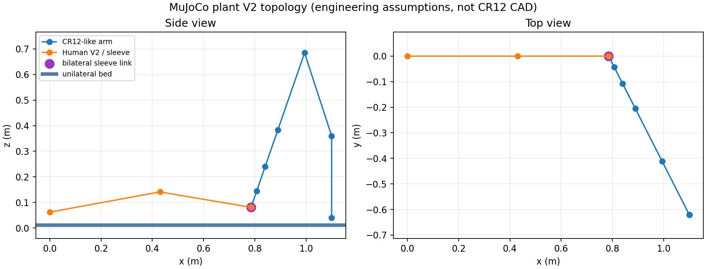
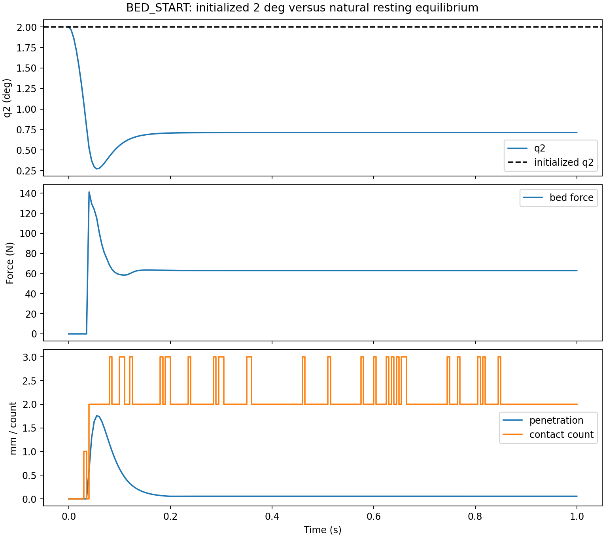
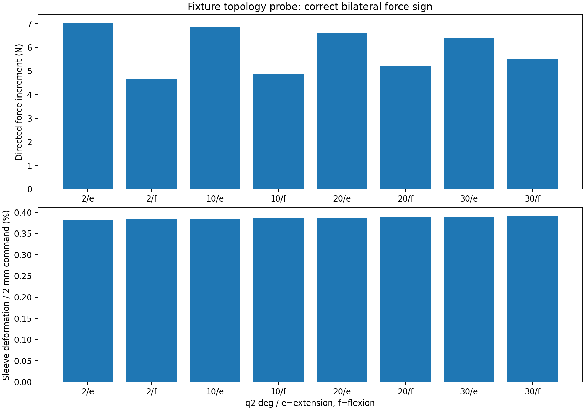
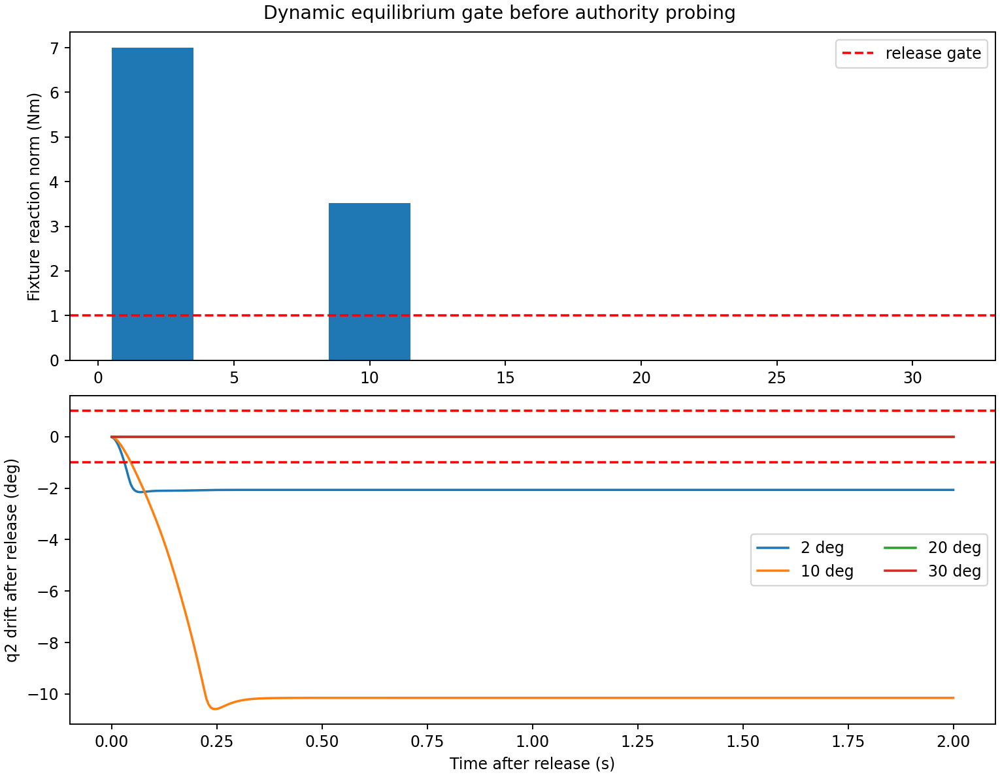
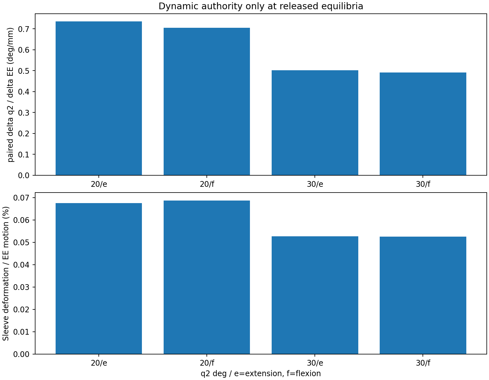

# MuJoCo Sleeve/Robot Plant V2

## Scope and result

This is an engineering-validation smoke test of the physical plant interface.
It is not a controller, clinical, hardware, or safety validation.  The fixture
topology probes passed at 2, 10, 20, and 30 degrees.  Released local equilibria
and bidirectional dynamic authority were demonstrated only at 20 and 30
degrees.  The 2 and 10 degree preload/equilibrium gates failed, so the complete
2 to 30 to 2 degree protective-mode motion was deliberately not run.

The result does not establish that protective mode is infeasible.  It shows
that this V2 engineering plant still lacks a validated low-angle support and
preload contract.

## Evidence categories

### Hardware facts available in the repository

- The repository contains `assets/robots/cr12_12_pending/urdf/CR12-12.urdf`
  and 18 STL files.
- The URDF has one root link, zero joints, zero inertials, zero transmissions,
  and no control interface.  It is a visual assembly, not a usable robot model.
- The repository audit identifies ROKAE CR12/CR12-12 only as the strongest
  provenance candidate.  There is no nameplate, serial number, calibrated
  kinematic chain, controller export, or lab interface contract.

Therefore the old asset was found but was not reused for V2 kinematics or
dynamics.  No precise CR12 parameter is claimed.

### MuJoCo engineering assumptions

| Part | Registered V2 assumption |
|---|---|
| Robot | Fixed-base, primitive-geometry, CR12-like six-revolute-joint serial arm; nominal reach 1.48 m; assumed masses, joint ranges, damping, and torque limits |
| Robot collisions | Disabled in V2; only the prescribed EE-to-sleeve load path is active |
| Command space | World Cartesian EE position and velocity |
| Controller | Six joint-torque motors; Cartesian PD (3000 N/m, 140 Ns/m), damped Jacobian transpose, bias compensation, and null-space posture term |
| Bound | Each Cartesian force-command component is clipped to +/-200 N; interaction-force norm is separately checked against the unchanged 200 N safety-veto value |
| Orientation | Uncontrolled in V2; only EE translation is constrained to the sleeve site |
| Sleeve | 80 mm long visual sleeve centered at 90% of Human V2 shank length; rigidly attached to the shank body |
| Robot-sleeve link | Bilateral three-axis MuJoCo `connect` equality, 6000 N/m and 120 Ns/m; not a tendon and not a collision-only cuff |
| Human | Existing nominal Human V2 geometry, masses, inertias, ROM, passive springs, and damping |
| Bed | Horizontal unilateral plane contact; friction 0.70, `solref=0.020 1`, 3 mm impedance width |
| Task values | q-switch 30 degrees, terminal q2 2 degrees, normal trajectory, and 200 N values unchanged |

These values were registered before the reported validation.  They were not
tuned after observing a failed posture.  The Cartesian controller is a clear
simulation interface, not a claimed ROKAE API.

## Topology



The sleeve is a region fixed to the shank.  The equality couples the robot EE
site to the sleeve attachment site in both translation directions.  There is
no tension-only element and no 0.5 kg planar carriage.

## Validation protocol

The reproducible command is:

```bash
conda run -n mpc_learn python scripts/run_mujoco_sleeve_robot_v2.py \
  --output-dir linkage/results/mujoco_sleeve_robot_v2
```

The run is categorized as `engineering_validation_smoke`.  It applies this
sequence:

1. Initialize the unchanged task posture at q2=2 degrees and hold the initial
   EE point with zero commanded offset, without a diagnostic fixture, until
   the registered stability window passes or four seconds elapse.
2. Lock Human V2 at q2=2/10/20/30 degrees only for topology probes.  Apply a
   2 mm C2 bidirectional EE command along the coordinated sleeve-motion
   direction and check force sign and interface deformation.
3. At each posture, perform a deterministic bounded search over Cartesian x/z
   preload offsets (each limited to +/-70 mm), then remove the diagnostic
   fixture and observe for two seconds.
4. Only at a posture that passes the released-equilibrium gate, compare a
   one-second hold with +/-1 mm C2 EE probes from the same snapshot.
5. Run the complete protective motion only if all four postures pass.  This
   condition was not met, so no full trajectory, GIF, or q-switch sweep was
   produced.

The bounded preload search is not a proof that no other physical support
arrangement exists.  It is a reproducible test of this registered actuator and
sleeve hypothesis.

## BED_START



| Metric | Observed value |
|---|---:|
| Initialized q2 | 2.000 deg |
| Natural settled q2 | 0.713 deg |
| Settle-until-stable time | 1.000 s |
| Final joint speed magnitude | below 2e-7 deg/s |
| Peak bed force (including 1 ms substeps) | 241.47 N |
| Final bed force | 62.96 N |
| Maximum penetration | 1.763 mm |
| Bed active/inactive transitions | 1 |
| Bed contact-point-count transitions | 298 |
| Peak sleeve interaction force | 50.72 N |
| Final sleeve deformation | 0.0054 mm |
| Final generalized-dynamics residual | numerical zero (below 2e-14 Nm) |

The plant reaches a static resting equilibrium under the zero-offset robot
hold, but that equilibrium is not the initialized 2 degree endpoint. Contact
force becomes steady and bed contact does not repeatedly open and close. The
large contact-count transition count comes from the plane/capsule contact
manifold alternating mainly between two and three solver contact points at
rest. This is discrete contact-manifold chatter, not force or joint-motion
chatter, but it remains a modeling issue to resolve before claiming contact
fidelity.

Maintaining 2 degrees requires a robot/sleeve preload or another physical
support.  That requirement is reported explicitly below.

## Fixture topology authority



| q2 | Extension force cosine | Flexion force cosine | Sleeve deformation / 2 mm command |
|---:|---:|---:|---:|
| 2 deg | 0.9999 | 0.9995 | 0.381-0.385% |
| 10 deg | 0.9976 | 0.9923 | 0.383-0.386% |
| 20 deg | 0.9944 | 0.9865 | 0.386-0.389% |
| 30 deg | 0.9936 | 0.9878 | 0.389-0.391% |

All fixture probes passed the registered sign, force, and deformation checks.
Because the fixture supplies large human generalized reactions, these probes
validate connection direction and geometry only.  Their small actual robot
motion must not be interpreted as free-body knee authority.

## Dynamic equilibrium and authority



| q2 | Preload x/z offset | Fixture reaction before release | Interaction force | q2 drift after 2 s | Gate |
|---:|---:|---:|---:|---:|---:|
| 2 deg | -69.68 / +15.91 mm | 7.00 Nm | 205.49 N | -2.045 deg | no |
| 10 deg | -67.99 / +15.95 mm | 3.52 Nm | 205.56 N | -10.137 deg | no |
| 20 deg | -62.34 / +15.95 mm | 0.000005 Nm | 192.46 N | -0.000007 deg | yes |
| 30 deg | -48.27 / +15.92 mm | 0.000005 Nm | 151.99 N | -0.00000004 deg | yes |

At 2 and 10 degrees the bounded controller saturates one Cartesian command
component at -200 N, the interaction-force norm exceeds the 200 N safety-veto
value, and a nonzero diagnostic-fixture reaction remains.  Those postures fail
before dynamic authority is evaluated.  At 20 and 30 degrees the fixture can be
released and both postures remain locally stable under the recorded preload.
No joint-torque limit is active in these equilibrium trials: the largest
assumed joint-limit fraction is 46.3%. The 48-70 mm values are position-target
offsets used by the simulated Cartesian loop, not sleeve stretch; whether a
real robot accepts this preload/error contract is unresolved.



| q2 | Direction | Paired delta q2 | Paired delta EE | Effective gain | Peak interaction | Sleeve deformation / EE motion |
|---:|---|---:|---:|---:|---:|---:|
| 20 deg | extension | -0.936 deg | -1.273 mm | 0.735 deg/mm | 194.05 N | 0.0676% |
| 20 deg | flexion | +0.903 deg | +1.280 mm | 0.705 deg/mm | 193.38 N | 0.0687% |
| 30 deg | extension | -0.612 deg | -1.219 mm | 0.502 deg/mm | 152.90 N | 0.0527% |
| 30 deg | flexion | +0.600 deg | +1.219 mm | 0.492 deg/mm | 152.68 N | 0.0525% |

The paired signs are correct at both eligible postures.  Sleeve deformation is
not the dominant motion sink: it is below 0.4% of the fixture command and below
0.07% of actual EE motion in the released probes.  This is a material change
from the V1 tension-only interface failure, but it does not repair the missing
low-angle equilibrium.

## Gate decision

- Fixture topology authority: passed at all four registered postures.
- Released dynamic equilibrium: passed only at 20 and 30 degrees.
- Bidirectional dynamic authority: passed at the two eligible postures only.
- Overall four-posture authority gate: not met.
- Complete 2 to 30 to 2 degree protective motion: skipped by gate.
- q-switch sensitivity and GIF/video: not run by scope and gate.

The plant is therefore not yet qualified to re-evaluate the complete protective
mode.  The next plant revision must first define and validate the physical
low-angle holding/load-transfer mechanism without changing the frozen task.

## Hardware information still required

1. Exact robot model and calibrated base-to-bed transform.
2. Manufacturer kinematic/dynamic export, joint limits, payload, and controller
   mode actually exposed by the lab system.
3. Real command contract: Cartesian position/velocity/impedance semantics,
   bandwidth, latency, saturation, internal collision logic, and stop behavior.
4. Sleeve dimensions, shank attachment location/orientation, strap or shell
   compliance, damping, slip, allowable pressure, and measured force-sensor
   frame.
5. Whether the hardware supplies preload at BED_START, and how that preload is
   established, measured, and released.
6. Bed compliance/friction characterization and the actual thigh/shank contact
   regions.
7. Human-to-bed and human-to-sleeve alignment tolerances and a validated safety
   veto/braking contract.

Until these are available, the CR12-like arm, controller, direct sleeve
equality, and preload search remain simulation hypotheses.  The observed
authority is simulation evidence only and is not a hardware-performance claim.
