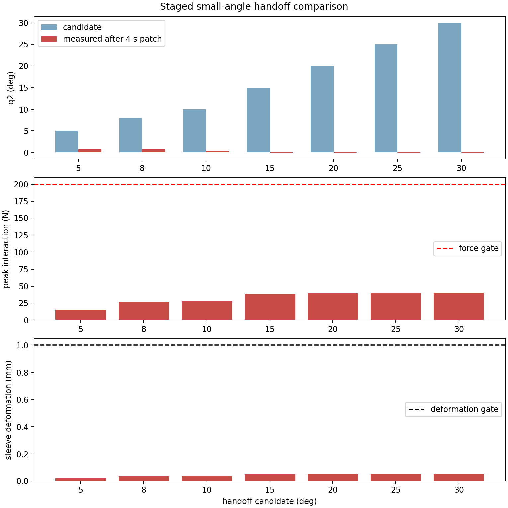
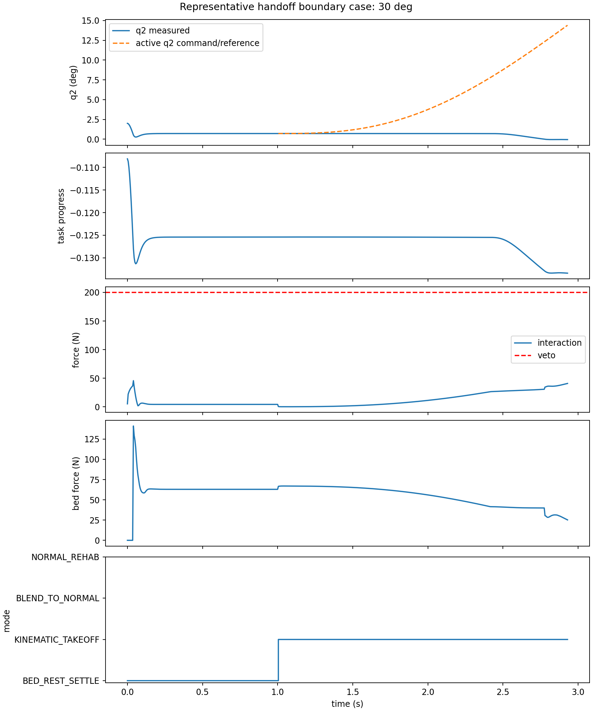

# MuJoCo Small-Angle Handoff Study

## Decision

No tested candidate reached the handoff state. The 5, 8, and 10 degree C2
takeoff commands left q2 near the settled bed-rest angle or moved it slightly
toward extension. The 15, 20, 25, and 30 degree commands also produced knee
extension and were stopped at the registered q2 ROM tolerance. Consequently,
the original normal controller was never allowed to take over.

Under the frozen MuJoCo plant V2 actuator and contact assumptions, this is not
evidence for a minimum reliable handoff angle. It is evidence that the current
kinematic takeoff does not establish the prerequisite knee motion at any
candidate. The proposed `small-angle patch -> normal rehab` architecture is
therefore unsupported in its current physical implementation.

This result does not establish a clinical or hardware threshold. It also does
not show that the retained normal controller fails: its gate was never reached.

## Frozen scope

The study retains:

- the CR12-like six-DoF robot, joint torque motors, Cartesian impedance values,
  geometry, masses, joint ranges, and limits from plant V2;
- the bilateral compliant sleeve fixed to Human V2 shank;
- the Human V2 geometry, masses, inertias, ROM, passive terms, and taught
  `slow_passive_flexion_v2` trajectory;
- the unilateral compliant bed contact;
- the 200 N actuator component and interaction-force veto values;
- the retained `bed_supported_v1_robot_controller` equations, gains, SVD
  solve, deterministic box QP, 250 N/s slew limit, and 2 ms update period;
- no Windowed NLS, R3C, R4, or recovery logic.

No mass, bed, sleeve, trajectory, force bound, terminal, initial task posture,
or controller gain was changed after observing the results.

The V2 kinematic target update remains 5 ms; only the retained normal law uses
its original 2 ms cadence if the handoff gate is reached.

## Normal-controller boundary

The retained MATLAB normal law outputs the two shank-local force components
`[tangent, normal]`. MuJoCo plant V2 exposes a robot Cartesian actuator. The
study therefore adds only this explicit adapter:

1. evaluate the source-faithful port of
   `bed_supported_v1_robot_controller` at 2 ms using measured q/dq, measured
   MuJoCo bed generalized torque, the unchanged taught reference, and the
   previously applied local force;
2. rotate its two local components into a world-frame EE force;
3. apply that force through the existing six-DoF robot `J^T F` joint-torque
   interface;
4. blend the actual Cartesian command with a C2 supervisor weight; do not
   alter the normal controller internally.

The adapter and controller port have deterministic unit tests. MATLAB is not
installed in the current execution environment, so a live MATLAB/Python
cross-language call was not possible. This does not affect the observed
candidate failures because every trial stopped before the normal-controller
call gate; the recorded call count is zero in all seven cases.

## Registered protocol and PASS gate

Each candidate starts from a fresh simulation:

1. initialize the unchanged 2 degree task posture;
2. command the initial robot EE point and settle until the registered V2
   stability window passes;
3. capture measured q/dq, which consistently settles near
   q=[-0.0046, 0.7130] degrees;
4. generate a four-second C2 joint-space patch from that measured state to the
   candidate coordinated posture, and convert it to a real Cartesian EE
   position/velocity command;
5. permit `BLEND_TO_NORMAL` only if measured q2 reaches the candidate within
   0.75 degree and joint speed is below 1 degree/s;
6. if admitted, blend for 0.75 s and require two seconds of full original
   normal-controller motion.

A candidate requires all of the following mechanical gates:

- settled BED REST;
- measured handoff position and velocity reached;
- first blend command jump no more than 1 N;
- interaction-force increase during blend no more than 30 N and absolute
  interaction force no more than 200 N;
- at least 0.05 actual taught-task progress over the two-second normal horizon,
  with no more than 0.01 progress reversal;
- no ROM or Human V2 soft-limit violation after handoff;
- no protective stop or actuator-component saturation;
- no more than two bed active/inactive transitions and no bed impact above the
  registered settled-force margin;
- sleeve relative deformation no more than 1 mm.

These are engineering study gates, not clinical or hardware thresholds.

## Staged search

The registered search is ascending. It stops after the first passing candidate,
then runs only its next neighbor and the 30 degree positive reference. Because
no candidate passed, all seven candidates were mechanically necessary and were
executed. The 30 degree case remains a reference point, not a default handoff.

The reproducible command is:

```bash
conda run -n mpc_learn python scripts/run_mujoco_small_angle_handoff_study.py \
  --output-dir linkage/results/mujoco_small_angle_handoff_study
```

## Results

| Candidate | Measured q2 at stop/end | EE position error | Peak interaction | Final bed force | Max sleeve deformation | Outcome |
|---:|---:|---:|---:|---:|---:|---|
| 5 deg | 0.709 deg | 5.06 mm | 15.19 N | 52.08 N | 0.0199 mm | did not reach; q2 moved toward extension |
| 8 deg | 0.689 deg | 8.76 mm | 26.30 N | 41.52 N | 0.0342 mm | did not reach; q2 moved toward extension |
| 10 deg | 0.308 deg | 9.12 mm | 27.38 N | 41.22 N | 0.0356 mm | did not reach; q2 moved toward extension |
| 15 deg | -0.050 deg | 14.18 mm | 38.63 N | 27.29 N | 0.0495 mm | ROM protective stop in wrong direction |
| 20 deg | -0.050 deg | 22.14 mm | 39.38 N | 26.64 N | 0.0499 mm | ROM protective stop in wrong direction |
| 25 deg | -0.051 deg | 31.01 mm | 40.10 N | 25.85 N | 0.0505 mm | ROM protective stop in wrong direction |
| 30 deg | -0.051 deg | 40.92 mm | 40.75 N | 25.21 N | 0.0511 mm | ROM protective stop in wrong direction |

All normal-controller call counts are zero. Therefore blend force-spike,
post-handoff progress, and normal-controller load-transfer gates are not
applicable rather than passing.





The synchronized representative animation is
[`representative_boundary_handoff.gif`](../results/mujoco_small_angle_handoff_study/representative_boundary_handoff.gif).

## Direct mechanism

The command is continuous and begins at the actual settled measured state. The
bilateral sleeve remains tight: maximum relative deformation is only
0.0199-0.0511 mm. Interaction force also remains far below 200 N. Thus the
failure is neither force saturation nor interface stretch.

Instead, the finite-stiffness V2 Cartesian position loop develops an endpoint
load that unloads the bed but produces the wrong generalized motion. Actual
taught-task progress is negative in every case. At 5-10 degrees the plant
settles with a persistent 5-9 mm EE error and essentially no knee flexion. For
15 degrees and above, q2 reaches the extension-side ROM stop before the target,
while bed force has fallen from approximately 63 N to 25-27 N. The natural
load transfer therefore occurs, but it transfers load along an incorrect
human generalized-motion direction.

This distinguishes three observations:

- **simulation evidence:** the current V2 EE impedance, sleeve attachment, and
  bed contact do not convert the registered position trajectory into knee
  flexion;
- **model assumption:** the controller stiffness, robot geometry, direct
  translational sleeve equality, uncontrolled EE orientation, and bed contact
  abstraction are engineering choices;
- **hardware claim:** none. Real robot servo authority and sleeve mechanics
  remain unknown.

## Architecture decision

The current three-segment implementation should not be retained as though only
the handoff angle were unresolved. There is no feasible handoff boundary in
the tested 5-30 degree set because the kinematic segment fails first.

The high-level idea of separating near-extension transition from normal rehab
may be revisited, but the next work must redesign and validate the physical
kinematic takeoff contract before another handoff search. Specifically, it
must identify why the robot EE command unloads the bed through hip motion and
knee extension, and establish a hardware-faithful position/velocity/impedance
interface with correct knee-direction authority. Increasing stiffness,
changing the bed, or altering the trajectory solely to obtain a successful run
is not supported by this study.
