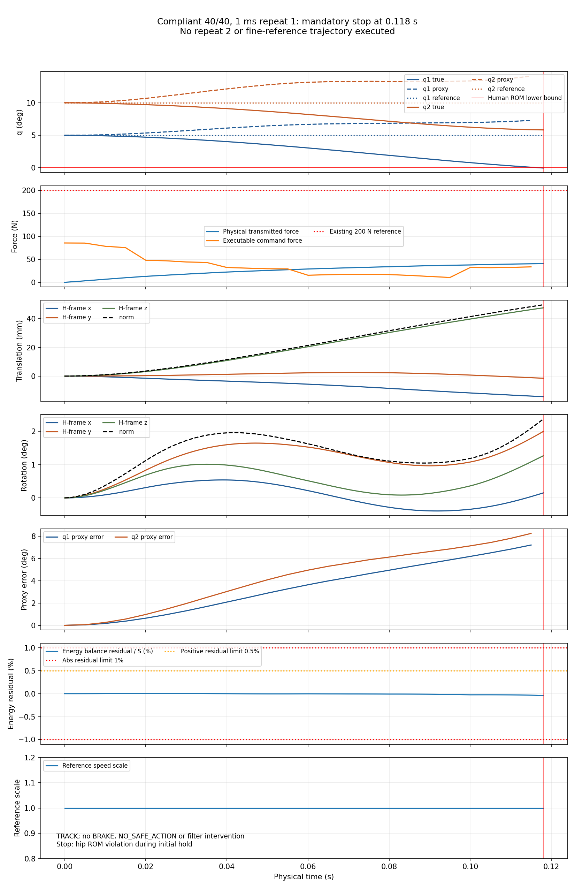

# Phase 3A compliant 40/40 numerical qualification: stopped on coverage

**Overall: FAIL_EVIDENCE_INCOMPLETE.** Only 1 ms repeat 1 ran. The frozen Human ROM guard terminated it at 0.118 s when hip q1=-0.0249297231631465 deg crossed the existing 0 deg lower bound. Initial hold lasts 1 s, so outbound motion had not begun.
This is neither a demonstrated interface/mechanics numerical failure nor a measured closed-loop timestep disagreement. Repeat 2 and the 0.25 ms matched reference were not admitted after the first run stopped.

## Approved Spec SHA256

- MD: `a7a0cb502f6ab3e0a4199fa1478130e42f898f33233f3bbc8ddaf97ef8c2c387`
- JSON: `4450bade85e12859cf25174fc7663bec639d26118f2539c8d033bdac4021d89b`

The original 5% Linf, 2% L2, energy budgets and independent 2 N physical-force peak difference gate remain frozen. The 2 N gate was not evaluated because the fine-reference run was not executed. The 200 N/transient contract was not changed.

## Five separate verdicts

| Category | Verdict | Scope |
|---|---|---|
| MECHANICS_CONSISTENCY | PASS on recorded prefix | finite; no warnings; port/action-reaction and instantaneous power checks |
| DISCRETE_ENERGY | PASS on recorded prefix | max absolute residual 0.0396451%; max positive residual 0.00794321% |
| CLOSED_LOOP_TIMESTEP_AGREEMENT | NOT_EVALUATED | no repeat 2 or matched fine reference; coverage gate failed |
| TASK_RESULT | UNSAFE_TERMINATION | Human ROM event, not force or robot limit; initial hold only |
| FORCE_CONTRACT | STRICT_PASS on recorded prefix | physical peak below 200 N; command also below 200 N |

PASS on a recorded prefix does not qualify the full 40/40 trajectory. Overall numerical qualification therefore fails and rigid-vs-compliant Phase 3A A/B is **not authorized next** by this gate.

## Run inventory and requested timestep comparison

| Run | Execution | Repeat/coverage result |
|---|---|---|
| 1 ms repeat 1 | EXECUTED; 119 physics samples, 24 control samples | stopped at 0.118 s |
| 1 ms repeat 2 | NOT_RUN | mandatory incomplete-coverage stop |
| 0.25 ms matched reference | NOT_RUN | mandatory incomplete-coverage stop |

1 ms deterministic repeatability is NOT_EVALUATED. Cross-dt waveform/force-peak/deformation/energy differences are N/A. The old 0.3 s mechanics fixture is not substituted as a matched reference.

| Metric | 1 ms recorded prefix | 0.25 ms matched reference |
|---|---:|---|
| Physical force peak (N) | 40.60892922 | NOT_RUN |
| Command force peak (N) | 85.62502584 | NOT_RUN |
| R-referenced moment peak (Nm) | 2.530136928 | NOT_RUN |
| H-referenced moment peak (Nm) | 2.61328049 | NOT_RUN |
| Translation peak (mm) | 49.74813506 | NOT_RUN |
| Rotation peak (deg) | 2.366554379 | NOT_RUN |
| Stored energy peak (J) | 0.6357795766 | NOT_RUN |
| Damping loss (J) | 0.9187996149 | NOT_RUN |
| Max abs energy residual (%) | 0.03964514412 | NOT_RUN |
| Max positive energy residual (%) | 0.007943205777 | NOT_RUN |

Final true hip/knee: [-0.024929723163146643, 5.830121057391388] deg; preceding sample at 0.117 s: [0.013736407039006686, 5.839457836471967] deg.
One ROM event, zero robot-limit events, zero unintended contacts, zero MuJoCo warnings, zero BRAKE, zero NO_SAFE_ACTION, and 24 SAFE_UNCHANGED filter decisions. Physical >200 N duration and excess impulse are zero. These are simulation observations, not a clinical safety claim.
No endpoint or return was reached. The inherited raw result field return_error_deg is early-stop deviation from the start state, not a completed return error; actual endpoint/return metrics are null in final_verdicts.json.

## Proxy and physical diagnostics

Offline hip/knee proxy q RMSE: [4.083586652259267, 4.972507794794967] deg; peak absolute errors: [7.195523652254721, 8.23562655390329] deg.
Offline proxy dq RMSE: [71.00347993033269, 89.09083797708584] deg/s; peak absolute errors: [95.90803466684092, 133.95080510035325] deg/s.
Translation RMS 26.943143 mm; rotation RMS 1.435731 deg; relative velocity peak 0.516354 m/s.
Robot-facing proxy and Human truth move apart while deformation grows in the initial hold. This supports reporting an observation/model mismatch in the compliant closed loop. No matched fine trace is available to distinguish physical behavior from timestep sensitivity, and correlation does not establish a unique controller-failure cause.



## Evidence interpretation

DIRECTLY OBSERVED: unchanged ROM guard triggered; low physical force; finite prefix with checked mechanical identities and small discrete energy residual; missing full-trajectory coverage.
SUPPORTED: the interface allowed robot/Human relative motion and a substantial robot-proxy error during the initial hold.
UNRESOLVED: full-trajectory numerical stability, 1 ms repeatability, timestep agreement, whether a finer timestep would change this event, and the unique causal contribution of CEM/action/reference dynamics.
NOT SUPPORTED: interface integration is unstable; the candidate is fully qualified; timestep refinement would fix the task; low force implies overall safety; ROM is structurally infeasible.

## Implementation, checks, commands, and git status

The two donor interface modules were added; only the spring-damper constructor signature was adapted to the de23ea3 API. The original 61 source/config/model files retain their hashes. A new plant/measurement adapter feeds only the restricted robot-port sample to the unchanged sensor processing. The unchanged runner code object uses private bindings for that adapter and the registered 5/20 substeps. There was no original controller/solver/physics/gain/Reference Manager/source edit.
Raw inherited diagnostic conventions are retained and explicitly annotated in raw_report_semantics.json. H-referenced physical moment must not be mistaken for R-referenced sensor moment. Separate R/H diagnostics and actual-timestamp derivative reports are preserved. The controller always receives the R-referenced transmitted wrench.
Pre-execution targeted pytest: 8 passed in 1.34 s. Tests covered frozen options/reset, measurement boundary, port mechanics, energy and waveform gates, independent 2 N gate, deterministic data and event transitions. No test integrated another trajectory.
Post-run checks: approved Spec and all registered implementation/source/config/model hashes unchanged; finite numeric NPZ arrays and time alignment checked; no new trajectory was executed during analysis.

Working directory: `/Users/hankli/Desktop/coding/adaptive-traction-mpc-interface-phase3a`

Executed commands:
```sh
PYTHONDONTWRITEBYTECODE=1 /opt/homebrew/Caskroom/miniconda/base/envs/mpc_learn/bin/python -m pytest -q -p no:cacheprovider stages/stage4_adaptive_control/tests/test_phase3a_soft_qualification.py
/opt/homebrew/Caskroom/miniconda/base/envs/mpc_learn/bin/python stages/stage4_adaptive_control/scripts/run_stage4_phase3a_soft_qualification.py --freeze-implementation
/opt/homebrew/Caskroom/miniconda/base/envs/mpc_learn/bin/python stages/stage4_adaptive_control/scripts/run_stage4_phase3a_soft_qualification.py --run-next
/opt/homebrew/Caskroom/miniconda/base/envs/mpc_learn/bin/python stages/stage4_adaptive_control/scripts/summarize_stage4_phase3a_soft_qualification.py
```

The single --run-next invocation returned exit code 2 to report the preregistered qualification stop; there was no runtime exception. No fourth run, tuning, other endpoint, A/B rollout, commit or push occurred. No further scientific command is admitted under this stopped Spec.

## Files added in this request

- stages/stage3_full3d/src/traction_mpc_stage3/spring_damper_interface.py
- stages/stage3_full3d/src/traction_mpc_stage3/interface_measurement_contract.py
- stages/stage4_adaptive_control/scripts/run_stage4_phase3a_soft_qualification.py
- stages/stage4_adaptive_control/scripts/summarize_stage4_phase3a_soft_qualification.py
- stages/stage4_adaptive_control/tests/test_phase3a_soft_qualification.py
- stages/stage4_adaptive_control/docs/PHASE3A_1MS_QUALIFICATION_SPEC_APPROVED.md
- stages/stage4_adaptive_control/docs/PHASE3A_1MS_QUALIFICATION_SPEC_APPROVED.json
- stages/stage4_adaptive_control/docs/PHASE3A_1MS_QUALIFICATION_SPEC_APPROVED.sha256
- All new evidence under stages/stage4_adaptive_control/results/engineering_validation/phase3a_soft_1ms_qualification_20260904_v1; exact result inventory is in SHA256SUMS.
The preflight and two DRAFT documents were already untracked at task start and remain preserved. Everything is uncommitted; HEAD remains 99169491ea1336d6af74e3b63318afba18c1e881.
