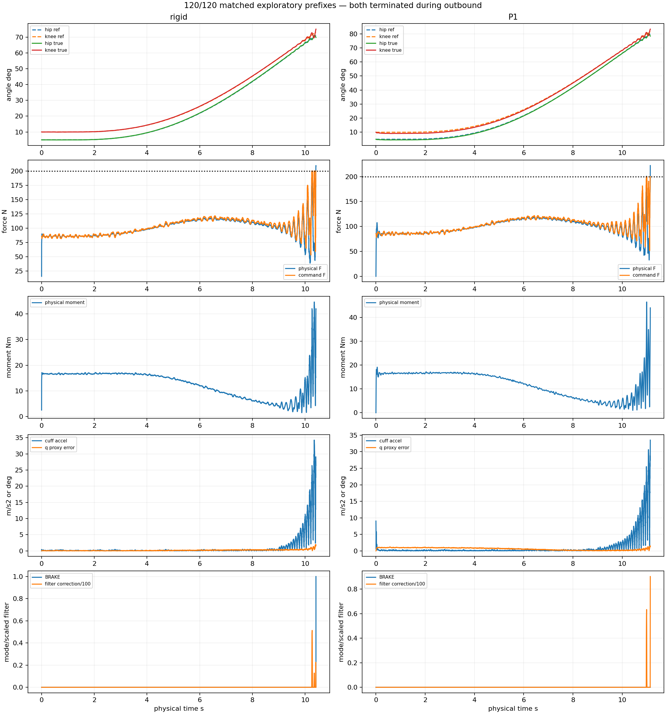
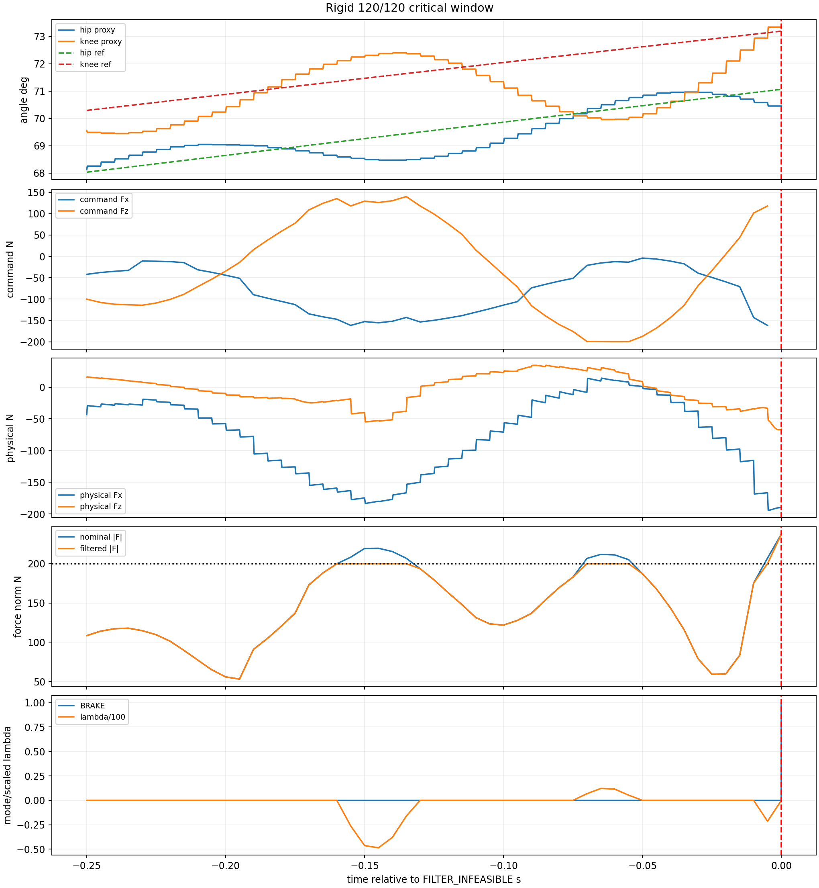
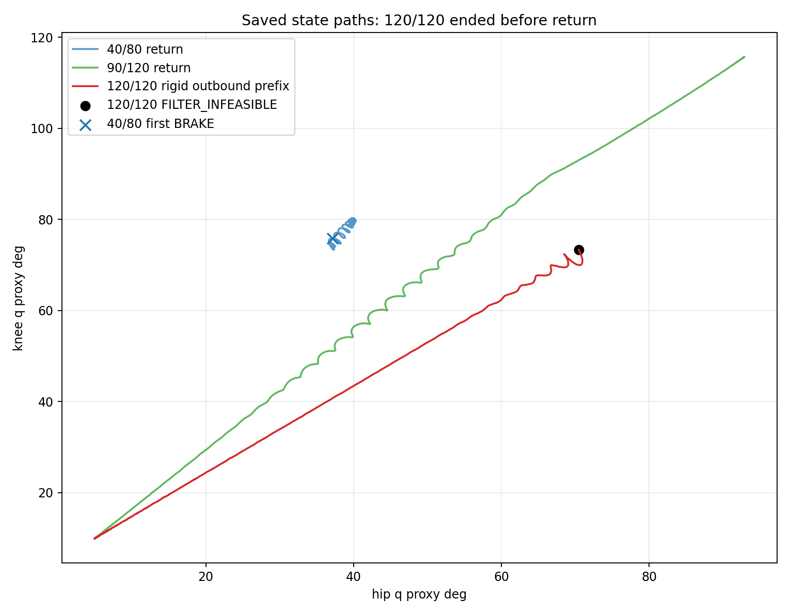

# Rigid vs P1 120/120 exploratory matched A/B

Checkpoint `0435070a46f23140d08c94e4dab1b9a01244e9c9`; Spec SHA256 `00091ce23ae27b009b99390837e310a47239535493e2da74df85df3041a57f1c`. Exactly two fresh processes were run: rigid then registered P1. Both ended during outbound; no additional trajectory was run. The prior strict compliant numerical-qualification FAIL remains unchanged.

## Matched metrics

| Arm | Formal | Termination | Ref out/return % | Physical outbound % | Target reached | Returned | Endpoint err deg | Terminal-vs-initial deg | Tracking RMSE deg | BRAKE/FILTER_INF/NSA | Command RMS/peak N | Physical RMS/peak N | Force slew peak N/s | Moment RMS/peak Nm | Accel RMS/peak | Jerk RMS/peak |
| --- | --- | --- | --- | --- | --- | --- | --- | --- | --- | --- | --- | --- | --- | --- | --- | --- |
| Rigid | NUMERICALLY_UNRESOLVED | BRAKE_INFEASIBLE | 53.99/0.00 | 57.1285 | False | False | n/a | 65.043 | 0.217854 | 1/1/0 | 103.80/200.00 | 100.61/209.55 | 251692 | 13.71/44.62 | 3.391/34.261 | 671.0/46455.9 |
| P1 | NUMERICALLY_UNRESOLVED | physical_force_policy_hard_violation | 58.20/0.00 | 64.7603 | False | False | n/a | 73.3825 | 0.49382 | 0/0/0 | 103.39/200.00 | 100.02/222.22 | 18163.8 | 13.19/46.49 | 3.383/33.513 | 243.8/7785.5 |

Endpoint error is `n/a` because neither reference reached target hold. The reported terminal-versus-initial error is the frozen `return_error_deg` field evaluated at early outbound termination; it is not evidence that a return was attempted. Physical outbound percentage is the maximum simultaneous minimum of the two normalized joint progresses.

## Actual completion

Rigid executed 53.99% of outbound reference and physically reached 57.13% simultaneous joint progress before FILTER_INFEASIBLE at 10.410 s. It neither reached [120,120] nor entered return.

P1 executed 58.20% of outbound reference and physically reached 64.76% simultaneous joint progress before the existing physical-force policy stopped it at 11.142 s. It neither reached [120,120] nor entered return.

## Rigid failure mechanism

The same immediate mechanism observed at rigid 40/80 is directly reproduced. From 10.405 to 10.410 s, the torque-preserving minimum achievable force rises 191.657 -> 213.086 N and crosses the unchanged 200 N gate. The estimated q/dq is unchanged across the measurement-held pair; Human allocation conditioning remains 5.310 and the null direction change is 0.000000 deg.

Nominal force changes by [-11.16663005711564, 0.3143707010891713, 32.599425173898] N. The allocator contribution changes by only [0.22944660064636935, -0.01209426209785627, 0.865259736556693] N (norm 0.895), while the derived feedback contribution changes by [-11.39607665776201, 0.32646496318702745, 31.734165437341318] N (norm 33.720). At the event no BRAKE candidate is feasible (`feasible_candidate_count=0`), so termination is BRAKE_INFEASIBLE. This supports the same feedback-driven wrench-change -> torque-preserving minimum >200 N mechanism; it does not identify which position/velocity feedback subterm caused the change.

## P1 failure and energy

P1 avoids FILTER_INFEASIBLE and BRAKE and advances 4.21 reference-percentage points farther, but its physical cuff force reaches 222.216 N and triggers the registered absolute transient ceiling. Its command remains bounded at 200.000 N. This is a physical-force-policy failure, not a numerical warning or runaway deformation.

| P1 diagnostic | Value |
| --- | --- |
| Translation peak/RMS mm | 1.341380/0.943481 |
| Rotation peak/RMS deg | 0.912669/0.368672 |
| Stored energy peak J | 0.377912 |
| Damping loss J | 0.986837 |
| Max abs residual J / ratio | 0.019110/1.4601% |
| Max positive residual J / ratio | 0.000120/0.0092% |
| Final residual / trailing slope | -0.017453 J / -0.066368 W |
| Growth watchdog triggers | 0 |

Energy remains diagnostic. Zero growth-watchdog triggers and bounded deformation do not requalify P1; the strict numerical-qualification FAIL is preserved.

## State proxy

| Arm | q RMSE hip/knee deg | q peak hip/knee deg | dq RMSE hip/knee deg/s | dq peak hip/knee deg/s |
| --- | --- | --- | --- | --- |
| rigid | [0.145078, 0.170123] | [0.627256, 1.44693] | [6.72588, 11.0865] | [59.4649, 127.486] |
| P1 | [0.307372, 0.631606] | [0.641262, 1.11557] | [7.38471, 8.09075] | [63.3259, 82.3333] |

## Cross-trajectory comparison

| Point | Rigid formal | P1 formal | Rigid progress | P1 progress | BRAKE R/P1 | Tracking RMSE R/P1 | Physical peak R/P1 N | Return/terminal error R/P1 deg |
| --- | --- | --- | --- | --- | --- | --- | --- | --- |
| 40/40 | COMPLETE | SAFE_INCOMPLETE | 100/100 | 100/100 | 0/0 | 0.158/0.556 | 117.45/118.68 | 0.013/0.828 |
| 40/80 | SAFE_INCOMPLETE | SAFE_INCOMPLETE | 100/100 | 100/100 | 1/0 | 24.662/0.447 | 197.50/123.20 | 64.241/0.797 |
| 90/120 | SAFE_INCOMPLETE | SAFE_INCOMPLETE | 100/100 | 100/100 | 0/0 | 1.929/1.741 | 158.73/130.23 | 0.052/0.867 |
| 120/120 | NUMERICALLY_UNRESOLVED | NUMERICALLY_UNRESOLVED | 53.99/0 | 58.20/0 | 1/0 | 0.218/0.494 | 209.55/222.22 | 65.043/73.382 |

Rigid 120/120 terminates during outbound at q=[70.45215571428949, 73.34172816855767] deg, 30.80 deg from the closest saved 40/80 return state and 12.94 deg from the closest 90/120 return state. Those prior matched states remain TRACK at 74.70 N and 68.08 N nominal force, respectively. The same local feasibility mechanism therefore occurs at a different configuration/history, but no 120/120 return path exists to test recurrence on return.

## Interpretation

### DIRECTLY OBSERVED

- Rigid: FILTER_INFEASIBLE/BRAKE_INFEASIBLE at 53.99% outbound reference; torque-preserving minimum achievable force is 213.09 N.

- P1: no BRAKE, 58.20% outbound reference, then physical-force absolute transient ceiling at 222.22 N.

- Both runs stop before target and return. Both have zero warnings, finite evidence and no Human ROM event.

### SUPPORTED BY CURRENT EVIDENCE

- Rigid 120/120 repeats the 40/80 feedback-dominated Safety Filter incompatibility mechanism, despite occurring during outbound at a different state.

- P1 shifts the limiting mechanism from executable-command infeasibility to physical transmitted-force violation and strongly reduces force slew/jerk, but does not rescue the task.

- The boundary remains path/history dependent and non-monotonic across the sampled trajectories: 90/120 stays TRACK throughout, while 40/80 fails on return and 120/120 fails on outbound.

### UNRESOLVED

- Because 120/120 never reaches return, this pair cannot determine how its return path would compare with 40/80 or 90/120.

- Saved data do not split the derived feedback wrench into position and velocity terms or provide per-candidate CEM winner scores.

- Single executions do not establish repeatability or numerical qualification.

### NOT SUPPORTED

- A consistent P1 task-completion benefit across trajectories.

- A monotone ROM capability boundary.

- Clinical safety, validated compliance physics, or reversal of the prior strict numerical FAIL.

## P1 benefit pattern

P1 benefits are trajectory-specific. At 40/80 it prevents rigid BRAKE and restores a near-complete physical return; at 90/120 it reduces force severity but does not change formal completion and worsens return precision; at 120/120 it avoids BRAKE and smooths force slew/jerk but produces a higher physical peak and a hard force-policy stop. At 40/40 it slightly worsens tracking and force peak. The consistent pattern is transient smoothing, not consistent force-peak reduction or task rescue.

## Reproducibility

Fresh process IDs: 8954 and 9002. Initial states are exact; configs match except interface. Source HEAD and 375 frozen hashes were verified. No controller, P1, Human/robot, geometry, trajectory timing, solver, dt, seed, measurement boundary, force limit, safety stack, or completion tolerance changed.

Commands: freeze once; `run_progressive_120_120_ab.py --run-next` exactly twice; this postprocessor once. No formal or additional trajectory command is admitted. Results remain uncommitted.
