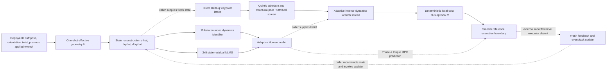

# Final Architecture Technical Deep Dive

Status: **source-audited description of the implementation that reached
`PHASE_3_READY`**

This document describes what the code actually implements. It does not promote
the interface smoke tests to hardware evidence, and it does not infer estimator
convergence from episode completion.

## 1. Executive description

The recovered controller is a two-layer human-side adaptive controller.

1. A commissioning motion estimates only the geometry visible at the cuff:
   sagittal hip position, thigh length, and knee-to-cuff distance. The full
   shank length and cuff fraction are deliberately not reconstructed.
2. A bounded 11-parameter inverse-dynamics model, plus a bounded
   state-conditioned two-joint torque residual, is fitted from reconstructed
   Human state and the applied cuff wrench. Commissioning beta identification
   is a **post-probe retrospective batch pass**; continual task adaptation is
   causal and uses only the previous applied command and current observation.
3. In the Phase-2 formal controller, that adaptive model is used by a
   horizon-8, 50 Hz, feasible-first CEM shooting MPC whose action is desired
   Human generalized torque. The selected torque is converted into a planar
   cuff force and sagittal cuff moment.
4. In Phase 3, the same adaptive belief schema is exposed to an event-driven
   Human-waypoint planner. That planner searches a finite lattice of direct
   two-joint waypoint increments, constructs the shortest feasible quintic
   reference segment, rejects schedules whose adaptive inverse-dynamics wrench
   exceeds the retained limits, adds an optional value term, and replans from
   caller-supplied fresh state. The current adapter does not itself reconstruct
   state, update the belief, execute the schedule, or command a robot.

The Phase-3 code is a production-shaped human-reference interface, not a
complete CR12 deployment. It does not contain a CR12 plant prediction, sensor
frame conversion, robot reach/collision/torque screening, or hardware command
transport. Its validated output is a smooth Human joint reference schedule.

## 2. Actual end-to-end data flow

The complete intended interface composition is below, but it is important not
to mistake composition for one wired Phase-3 loop. The Phase-2 runner closes
observation, reconstruction, adaptation, MPC, simulated plant execution and
feedback. Phase 3 implements the waypoint/schedule/screen/value block only:
the caller must provide `AdaptiveHumanBeliefV22`, deployable state and current
reference state, and must execute the returned schedule and invoke any belief
updates. Dashed arrows mark those unwired caller responsibilities.

The quantities crossing each boundary are:

| Boundary | Quantity | Shape/units | Source category |
|---|---|---:|---|
| observation -> geometry | cuff position `(x,z)` and shank/cuff angle `phi` | 2 m + 1 rad | measured/deployable |
| observation -> state | cuff pose, linear velocity, angular velocity | pose + 6-D twist | measured/deployable; formal simulation twist is ideal |
| geometry -> state | planar basis, hip `(x,z)`, `L1`, knee-to-cuff vector | control-effective geometry | `ONLINE_ESTIMATED` |
| state -> dynamics | `q_hat`, `dq_hat`, `ddq_hat` | 2+2+2 | reconstructed; task uses causal one-step difference, commissioning uses retrospective gradient |
| previous command -> dynamics | generalized torque reconstructed from previous force/moment | 2 Nm | previously applied command |
| identifier -> model | `beta` | 11 control-effective coefficients | `ONLINE_ESTIMATED` |
| residual learner -> model | `W` and residual limit | `2x5` Nm, 12 Nm | `ONLINE_ESTIMATED` |
| task -> waypoint planner | phase, start/goal, independent q bounds, velocity/acceleration limits, tolerances, timeout | config | calibrated/provisional contract |
| planner -> scheduler | candidate `Delta q`, zero target velocity | 2 rad + 2 rad/s | deterministic |
| scheduler -> mechanics | sampled `(q,dq,ddq)` quintic | 21 samples in Phase 3 | deterministic |
| mechanics -> scorer | feasible flag, peak force, peak moment, peak residual | Boolean/N/Nm | predicted from adaptive belief |
| scorer -> execution | selected finite schedule | `q_ref,dq_ref,ddq_ref` | deployable reference |
| execution -> next update | fresh observation and the command actually applied | measured plus command history | causal |

The Phase-2 simulation closes the last boundary by integrating a hidden Human
plant with the allocated wrench. Hidden setup enters only generation, plant,
the explicit oracle arm, and evaluation. The Phase-3 interface does not close
this boundary on CR12 hardware.

## 3. Component inventory

| Component | Purpose and update trigger | Exact implementation | Deployability |
|---|---|---|---|
| Effective geometry | Fit control-sufficient kinematics once after commissioning; reject insufficient span, poor fit, bad conditioning, or bounds | `effective_model.py`: `EffectiveGeometryFit`, `fit_effective_geometry`, `CausalEffectiveGeometryEstimator`, `build_planar_geometry` | Deployable inputs; formal clearance comparison is evaluation-only |
| State reconstruction | Recover `q,dq` from cuff pose/twist under fitted geometry | Stage-4 `estimator_v2.py`: `PlanarCuffGeometry.estimate_q`, `.estimate_state`, `.generalized_input_from_wrench` | Deployable; formal twist quality is simulation-specific |
| Base dynamics | Bounded batch fit of an 11-D inverse-dynamics base vector: retrospective processing after the commissioning probe, then causal updates during the task | `effective_model.py`: `OnlineEffectiveDynamicsIdentifier`; Stage-4 `estimator_v2.py`: `dynamic_regressor_row`; commissioning loop in `functional_benchmark.py` | Task path is deployable/causal; the formal commissioning implementation is not a live streaming estimator |
| State residual | Learn remaining state-dependent generalized-torque error | `functional_benchmark.py`: `_state_residual_features`, `_update_state_residual_weights`, `StateResidualHumanModel`, `StateResidualHumanSpaceMPC` | Deployable representation; formal telemetry is evaluation/provenance |
| Phase-2 adaptive MPC | Predict Human state and choose feasible generalized torque | Stage-4 `mpc.py`: `HumanMPCConfig`, `HumanSpaceMPC`; V2 subclass `StateResidualHumanSpaceMPC` | Deployable algorithm, simulation-validated only |
| Wrench allocation | Map two generalized torques to minimum translational force plus free sagittal moment | Stage-4 `estimator_v2.py`: `BaseParameterHumanModel.allocate_generalized_action` | Model-side deployable calculation; not a physical F/T sensor conversion |
| Phase-3 waypoint search | Choose the next direct Human `Delta q` from fresh state | `human_waypoint_feedback_mpc.py`: `HumanWaypointFeedbackMPCV1` | Deployable planning interface, smoke-tested |
| Reference scheduler | Produce shortest registered-grid quintic satisfying motion/ROM/bed rules | `human_waypoint_scheduler.py`: `QuinticHumanWaypointSchedulerV1` | Deployable reference generator; bed geometry is a structural prior |
| Adaptive mechanics screen | Evaluate each schedule through adaptive inverse dynamics and wrench allocation | `phase3_human_waypoint.py`: `AdaptiveMechanicsScreenV22` | Deployable model screen, not hardware safety certification |
| Belief adapter | Preserve full numeric geometry, beta, residual weights and provenance; provide an explicit updater API | `phase3_human_waypoint.py`: `AdaptiveHumanBeliefV22`, `StateResidualBeliefUpdaterV22` | Deployable API, but the event-driven planner does not invoke the updater |
| Event/task owner | State-driven OUTBOUND/HOLD/RETURN/COMPLETE and timeout | `task.py`: `GoalTaskSpec`, `transition_phase`; adapter `EventDrivenAdaptiveHWMPCV22` | Deployable semantics, provisional task limits |
| Value hook/record | Add future value after hard screens and log causal transitions | `HumanWaypointFeedbackMPCV1._evaluate`; `EventDrivenAdaptiveHWMPCV22` record methods | Hook is deployable; training is absent |

## 4. Effective geometry and state reconstruction

### 4.1 Representation and estimator

For a measured cuff point in the sagittal plane,

`p_c = h + L1 e(q1) + s_c e(phi)`,

where `h=[hip_x,hip_z]`, `e(theta)=[cos(theta),sin(theta)]`,
`phi=q1-q2`, and `s_c=f L2` is the knee-to-cuff distance. For a candidate
`s_c`, subtracting `s_c e(phi)` produces knee points that must lie on a circle
of center `h` and radius `L1`. `fit_effective_geometry` solves this nonlinear
least-squares problem with a population prior.

The final state is exactly `(hip_x, hip_z, L1, s_c)`. Neither full shank length
`L2` nor cuff fraction `f` is present because the cuff channel identifies their
product, not both factors. The fit requires at least 30 samples and at least
4 deg angular span, and accepts only residual RMS <= 3 mm and a least-squares
Jacobian condition number <= `2e5`. That Jacobian includes regularization rows
and its columns are not explicitly normalized before the SVD. Bounds are hip x
`[-0.35,0.35] m`, hip z
`[-0.05,0.30] m`, `L1=[0.30,0.56] m`, and `s_c=[0.14,0.48] m`.

The V2 final path calls `CausalEffectiveGeometryEstimator.attempt_fit()` once
after the probe. There is no geometry covariance, online smoothing, or
per-update geometry rate limit in this path. Rejection fails closed for all
adaptive/effective-geometry arms. The fit record carries residual RMS, maximum
residual, condition number, sample count, angular span, acceptance and reason.

### 4.2 State and wrench reconstruction

With the fitted geometry,

- `q1 = atan2(knee_z-hip_z, knee_x-hip_x)`;
- `q2 = q1 - phi`;
- `dq` is the least-squares solution of the stacked translational and angular
  cuff Jacobian against measured twist;
- the previous physical wrench becomes generalized input through
  `tau = J_v(q)^T F + [-M_axis,+M_axis]` in the embedded world X/Z plane,
  where `M_axis=joint_axis_world^T M_world` (the allocator's internal scalar
  later denoted `mu` has the opposite sign).

The formal V2.2 task uses the measured cuff twist directly. It intentionally
removed an extra velocity low-pass lag because that lag misaligned
`q,dq,ddq,tau` and caused beta to absorb filter phase. Acceleration is the
one-step finite difference of reconstructed velocity at 50 Hz. This is causal
but noise-sensitive; the formal domain used ideal noiseless simulated twist,
so hardware derivative filtering remains unresolved.

## 5. The final adaptive belief

### 5.1 Complete contents

`AdaptiveHumanBeliefV22` contains:

- full numeric `PlanarCuffGeometry` (world origin/basis, hip, thigh length,
  knee-to-cuff vector);
- 11-D `beta`;
- `2x5` state-residual coefficient matrix `W`;
- residual limit `12 Nm`;
- monotone belief sequence;
- dynamics sample count;
- accepted beta update count;
- residual update count;
- provenance categories for geometry, dynamics and residual;
- an enforced `deployable_truth_consumed=false` flag.

It contains no hidden setup, true Human parameters, true state, oracle error,
or evaluation clearance. It carries diagnostics and counts, but no posterior
covariance or probabilistic confidence. Rank, condition, residual and validity
gates are the available support representation.

### 5.2 Beta definition and physical interpretation

The vector order, frozen in `DYNAMIC_BASE_PARAMETER_NAMES`, is

`beta=[a,b,d,g1,g2,k1,k2,rho1,rho2,bv1,bv2]`.

The first three are inertia combinations, `g1,g2` are gravity combinations,
`k1,k2` are passive stiffness, `rho_i=k_i q_rest_i` are stiffness/rest
composites, and `bv1,bv2` are viscous damping. They are control-effective base
parameters, not an identified anatomy. The inverse dynamics is

`tau_beta = Y(q,dq,ddq) beta - tau_soft(q,dq)`.

`Y` is the exact planar 2R regressor implemented by
`dynamic_regressor_row`. Samples for which registered nonlinear soft-limit
torque is nonzero are excluded because that term is not in the linear
regressor.

Initialization is `nominal_base_parameters(HUMAN)`. The bounded ridge fit uses
all accumulated rows in formal V2.2 (`maximum_history_samples=null`):

`z* = argmin_z ||Y (beta0 + span*z) - tau||^2 + 1e-3 ||z||^2`,

subject to beta bounds. Non-rho entries use `[0.45,1.65]` times the population
prior; rho bounds use `[-0.30 k_i^0, 0.60 k_i^0]`. A boundary coordinate is
frozen at its last-valid value and the correlated free coordinates are refit.
If the fitted mass matrix violates the `0.03` minimum eigenvalue over 21 q2
samples from 0 to 100 deg, the three inertia coordinates are frozen and the
other eight are refit. Full rank, condition <= `2e5`, nonworsening residual
(allowance `0.02 Nm`), a nonempty free set, optimizer success, and mass margin
are required.

After acceptance,

`beta+ = clip_bounds(beta + clip(0.10*(beta_candidate-beta), +/-0.03*span))`.

The first attempt requires 80 accepted rows. Thereafter an attempt occurs each
25 rows. In commissioning, however, these updates do **not** execute live at
100 Hz. After the probe has completed, `run_closed_loop_case` reconstructs the
whole probe history, computes acceleration with `np.gradient(...,
edge_order=2)`, discards two samples at each end, and replays the remaining
rows through the identifier. Thus reported commissioning update times index
the probe record (nominally 0.25 s between attempts after the first), but the
computation is retrospective and central differences use future-neighbor
samples. During the 50 Hz task, acceleration is a causal one-step difference
and attempts occur every 0.50 s. Rejection retains the last beta.

### 5.3 State-conditioned residual

The residual feature vector is

`phi(x)=[1, q1_ROM, q2_ROM, dq1/(1+|dq1|), dq2/(1+|dq2|)]`,

where each `q_ROM` maps the registered joint interval to `[-1,1]` and velocity
is in rad/s with the frozen 1 rad/s scale. The additive model term is

`r_W(x)=clip(W phi(x), -12, +12) Nm`,

and the final inverse dynamics is `tau = Y beta - tau_soft + r_W(x)`. It enters
both the inverse-dynamics seed and every batched state propagation performed by
`StateResidualHumanSpaceMPC`.

For the previous sample, after the beta update, the learner forms

`r_sample = tau_applied - Y(q,dq,ddq) beta`.

With `r_hat=clip(W phi)`, normalized LMS applies

`W_candidate = W + 0.20 (r_sample-r_hat) phi^T/(phi^T phi)`.

Each output row is then projected to L2 norm <= `12 Nm`. The current prediction
is clipped before forming the error and deployed model outputs are clipped;
the raw observed target `r_sample` itself is **not** clipped. The telemetry
field named `observed_output_cap_hit` actually tests the newly projected
`W_candidate phi` at the update state, not the observation. Unlike beta, this
layer updates on every eligible 50 Hz task sample. It has no separate per-update
step cap; alpha, feature normalization, row projection, and output clipping are
its bounds. The formal implementation logs projection and clipping events.

### 5.4 Old alpha_M / alpha_K / alpha_D question

1. **Does the final system use the old three-scale model?** No. The historical
   `effective_mass_scale/effective_stiffness_scale/effective_damping_scale`
   projection in Stage-4 `minimal_adaptation.py` is not the final estimator.
2. **What replaced it?** A free but bounded 11-D control-effective beta plus
   the bounded five-feature residual map.
3. **How do they interact?** The old projection remains historical/reference
   code only. Its three groups correspond to subsets of beta, but no three
   alpha values are updated or passed into the final controller.
4. **Can dynamics absorb geometry error?** Yes, beta is control-effective and
   can partially absorb small kinematic/Jacobian mismatch; the task residual
   can absorb remaining generalized-torque error. Neither is proof of correct
   anatomy.
5. **What prevents/detects this?** Geometry is fitted first and kept separate;
   wrong-geometry+adaptive-dynamics is a formal ablation; geometry errors and
   beta error are evaluation-only diagnostics; beta bounds, rank/condition,
   active-set refit, mass-matrix margin and residual telemetry limit pathological
   absorption. There is no theorem that completely separates geometry and
   dynamics from cuff-only data.
6. **Is there an old max-step/slow-update equivalent?** Yes for beta: 10%
   smoothing, a 3%-of-span step cap, and a 25-sample attempt interval remain.
   No equivalent fixed step cap exists for the state-residual NLMS, which runs
   at eligible task-sample rate and is norm/output bounded.
7. **Is adaptation settled at episode end?** Case dependent, and the logs do
   not implement a settling criterion. Beta attempts continued to within
   `0.008--0.475 s` of episode end (median gap `0.230 s`); the residual updated
   on 470--741 samples per case. The correct classification is usually **still
   updating but not clipped**, not “converged.”

## 6. Formal V2.2 adaptation trajectories and limitations of the log

Across the 24 candidate episodes, commissioning accepted 17--30 beta updates
(median 26). Task beta accepted all 569 attempts, 19--30 per case (median 24).
The residual updated 470--741 times per case. There were zero coefficient-row
projections and zero updated-output, prediction, or chosen-rollout cap hits.
Across cases, the largest logged learned residual output at update states was
3.9535 Nm, the largest residual-output step was 0.8690 Nm, largest
weight-component step 0.4580 Nm, largest residual total variation 15.9593 Nm,
largest weight total variation 22.3376 Nm, and maximum residual sign-reversal
count 27. Raw residual samples were not retained, so their maximum cannot be
recovered from the formal artifact.

Representative formal case `setup=875488092`, `task=1498019053` (coordinated,
11.862 s) shows continued beta motion rather than a completion-only claim. The
beta columns below follow the exact order in Section 5.2.

| stage / time | applied beta | old -> trusted model residual RMS |
|---|---|---:|
| last commissioning beta update, record time 8.06 s | `[1.3311,.2685,.3161,33.3339,7.4797,10.9200,10.9556,3.3625,2.4208,4.3163,5.3198]` | .3121 -> .2238 Nm |
| task update 1, .30 s | `[1.3343,.2739,.3164,33.5223,7.4244,10.9737,10.9786,3.5284,2.4836,4.3275,5.3188]` | .2957 -> .2217 Nm |
| task update 8, 3.80 s | `[1.3496,.2983,.3208,31.4853,8.0415,10.3306,11.0338,2.6106,1.8895,4.4164,5.3105]` | .3094 -> .2047 Nm |
| task update 16, 7.80 s | `[1.3549,.3088,.3258,29.6504,8.3967,9.7697,10.9624,.8879,1.5133,4.4933,5.3190]` | .2577 -> .1877 Nm |
| task update 24, 11.80 s | `[1.3580,.3139,.3284,28.9315,8.1988,9.5278,10.9322,-.1688,1.7004,4.5634,5.3231]` | .1889 -> .1742 Nm |

That case made 593 residual updates. Final `W` rows were
`[.0274,-.0298,-.0443,.1228,.1996]` and
`[.00638,-.00099,-.00172,-.0205,-.0332]` Nm; peak logged learned residual
output at update states was .6949 Nm,
maximum learned residual-output update step .0414 Nm, weight-component step .0329 Nm,
and neither projection nor cap fired. Full-episode joint RMSE was .2861 deg and
final absolute q error was `[.0129,.0296] deg`.

The formal artifact does **not** retain per-sample `W`, per-sample residual,
or per-sample tracking-state arrays. It retains the beta attempt trace and
aggregate residual/tracking telemetry. Therefore this report does not invent a
time plot for missing signals. A future logging-only study could add those
traces, but it would be new evidence rather than a reconstruction of V2.2.

## 7. Commissioning-only, continual, fixed and oracle arms

| Arm | Geometry | Beta | State residual | Task updates | Meaning |
|---|---|---|---|---|---|
| final `adaptive_state_residual` | fitted effective geometry | commissioning + continual | five-feature NLMS | beta every 25 eligible rows; residual every eligible row | final V2.2 candidate |
| `adaptive` | fitted effective geometry | commissioning + continual | one task-wide 2-D EWMA torque bias (`alpha=.20`, limit `12 Nm`) | beta every 25 eligible rows; bias every eligible row | V2.1-style diagnostic retained in the V2.2 experiment, not a beta-only arm |
| `commissioning_only_dynamics` | fitted effective geometry | commissioning fit frozen | none | none | tests whether probe-only adaptation suffices |
| `no_dynamics_adaptation` | fitted effective geometry | population nominal | none | none | isolates dynamics adaptation |
| `fixed_nominal` | first-pose nominal geometry | population nominal | none | none | fully fixed control model |
| `wrong_geometry_adaptive_dynamics` | first-pose nominal geometry | commissioning + continual | one task-wide 2-D EWMA torque bias (`alpha=.20`, limit `12 Nm`) | beta every 25 eligible rows; bias every eligible row | tests geometry/dynamics confounding, but does not isolate beta alone |
| `oracle` | hidden true geometry/state | hidden true beta | none | none | evaluation-only nondeployable lower-bound reference |

The `commissioning_only` boolean in `run_closed_loop_case` is a separate mode
that stops after commissioning; the formal comparison arm
`commissioning_only_dynamics` continues the task with the commissioning beta
frozen.

### Frozen 21.3701% criterion

For each completed or full-horizon row, the code computes

`RMSE_case = sqrt(mean_{time,joint}((q_true-q_ref)^2))` in degrees.

The arm statistic is the NumPy linear median across all 24 paired cases with
complete full-horizon metrics. The improvement is

`I = (median_commissioning - median_candidate)/median_commissioning`.

Using the frozen artifact,

`I=(0.6066526245-0.4770103605)/0.6066526245=0.213701`, or 21.3701%.

The gate in `phase2_v22/formal_unknown_setup_task_v22.json` requires at least
20%, or alternatively a completion-rate advantage of at least 0.25. The code
is `run_functional_campaign.py:evaluate_gates`, check
`adaptive_beats_commissioning_only`. V2.2's completion advantage was only
`1.0-23/24=4.17%`, so the median branch is the branch that passed. The 20%
threshold was preregistered as a material comparison gate before outcomes; the
repository does not document a statistical-power derivation for that number.

## 8. Commissioning probe

The final probe is commissioning-only; it is absent during the task. It runs at
100 Hz for 8 s, followed by up to 4 s of event-driven settling. Its target is
defined from the first measured cuff pose and a population q anchor, not the
hidden initial state:

- first 35%: quintic move `+20 deg` in both estimated joints toward the ROM
  interior;
- next 45%: windowed independent harmonics, q1 amplitude 8 deg at one cycle
  over the excitation interval and q2 amplitude 7 deg at two cycles;
- final 20%: return to the interior target with zero target velocity;
- post-probe: hold that target until estimated speed is <=5 deg/s for 20
  consecutive 10 ms samples, otherwise abort at the 4 s timeout.

Cuff impedance gains are 2400 N/m and 150 N s/m, orientation gains 70 Nm/rad
and 6 Nm s/rad, with limits 180 N and 30 Nm. Settling reduces damping to
75 N s/m and 3 Nm s/rad. A causal consistency envelope, registered Human ROM
evaluation, analytical shank/bed clearance evaluation, nonfinite checks and
settle timeout all fail closed.

The probe excites cuff position/orientation for the circle geometry fit and
the inertia, gravity, stiffness/rest and damping columns of `Y`. It is required
because ordinary task motion alone does not guarantee identifiable geometry
or a sufficiently conditioned initial model. It is not a continuous
production dither.

The final 100 Hz choice repaired a 50 Hz discrete handoff limit cycle that
produced approximately `[-39.8,-253.9] deg/s` in a preserved failed case.
Other rejected approaches included model-free cuff excitation with coarse
integration, population computed-torque support that was not robust to the
hidden domain, symmetric probing near unknown lower ROM, poorly conditioned
impedance excitation, fixed-time handoff, and excessive settle damping.

## 9. Phase-2 adaptive MPC formulation

### 9.1 State, action, model and cadence

- state: `x=[q1,q2,dq1,dq2]` from fitted geometry and cuff twist;
- adaptive variables: fixed session geometry, current beta, current `W`;
- action: `u=[tau1,tau2]`, desired Human generalized cuff action in Nm;
- prediction: RK4 integration of `M_beta(q) qdd = u-h_beta(q,dq)-r_W(x)`;
- control/prediction timestep: 0.02 s (50 Hz);
- horizon: 8 steps = 0.16 s;
- candidates: 24 sequences per CEM iteration;
- optimizer: two feasible-first cross-entropy iterations, five elites;
- exploration standard deviation: `(8,4) Nm`, floors `(.8,.4) Nm`;
- fixed optimizer RNG seed independent of hidden case seeds.

### 9.2 Objective and constraints

For predicted states and actions, the actual formal objective is

`sum ||(q-qref)/2deg||^2 + ||(dq-dqref)/8deg/s||^2`

`+ 0.002 sum ||u/[60,30]Nm||^2`

`+ 0.005 sum ||Delta u/[20,10]Nm||^2`.

Here `Delta u_0=u_0-last_action`, while
`Delta u_k=u_k-u_(k-1)` for later horizon steps.

The optional interaction-force objective weights in `HumanMPCConfig` remain
zero in V2.2. Hard prediction checks enforce registered Human q limits and
translational cuff force <=200 N across the horizon. The executable first
action preview additionally enforces moment norm <=60 Nm. This distinction is
important: a 60 Nm moment gate is not propagated as a separate constraint at
every future prediction step in the Phase-2 MPC, although the executed first
action is screened.

The initial mean is an inverse-dynamics tracking heuristic. If a previous
sequence exists, the shifted previous sequence is blended 35% with 65% of the
new heuristic. Feasible candidates update the CEM mean/std. There is no
separate local optimizer in this configuration. If no candidate has a feasible
executable first action, `solve` returns no action and the episode aborts; no
hidden nominal or clipped fallback is applied.

The current measurement updates beta/residual before the next MPC solve using
the previous command/sample. Thus the selected action never uses its own
future outcome.

### 9.3 Historical versus recovered versus waypoint MPC

| Layer | What it optimizes | Reused | Replaced/new |
|---|---|---|---|
| Stage-1/4 trajectory MPC | generalized Human torque sequence tracking a supplied trajectory | Stage-4 Human-space CEM, RK4, inverse dynamics, wrench allocator | old anatomy/three-scale identification is not final |
| recovered Phase-2 | same torque-sequence abstraction, but with fitted effective geometry, 11-beta, continual state residual and strict truth firewall | `HumanSpaceMPC`, base regressor/model | estimator, residual subclass, domain/gates/probe |
| Phase-3 HWMPC | one next Human waypoint increment and its quintic schedule | Stage-5 scheduler/task state machine; adaptive model for mechanics | no torque-sequence CEM in high-level choice; direct lattice and value hook |

Calling all three “MPC” does not make them identical. Phase 3 is receding
finite-candidate waypoint optimization; low-level trajectory execution remains
an interface boundary.

## 10. Human-waypoint Phase 3

### 10.1 Direct action and candidate diversity

For OUTBOUND/RETURN, the action is

`Delta q = sign(q_goal-q_now) * min(requested_step, |q_goal-q_now|)`.

The requested step is the task span times maximum fraction 0.20, one of scales
`{0.5,1.0}`, and one of five positive coordination directions
`(1,.5),(1,.75),(1,1),(.75,1),(.5,1)`. This yields up to ten unique two-joint
candidates. HOLD has one candidate, `q_goal-q_now`. Every planning call rebuilds
the lattice from fresh deployable q, so candidate targets and goal saturation
change with state. `exploration_rank` may choose a bounded top-k feasible
candidate, but the default is rank-0 greedy.

Tasks enter through `GoalTaskSpec`: independent start/goal pairs, q bounds,
position/velocity tolerances, hold duration, timeout, and joint velocity and
acceleration limits. No fixed `r`, fixed coordination ratio, full path, or
outbound-path replay is required. The current validated fixture is the
provisional `[5,10] -> [20,35] deg` task; source generality is not formal proof
over arbitrary hardware tasks.

### 10.2 Reference construction

`QuinticHumanWaypointSchedulerV1.plan_reference_contract` joins the current
emitted reference state to candidate q with zero target velocity. It searches
the shortest duration on the 5 ms grid that satisfies:

- task and registered Human q bounds;
- configured joint velocity limits;
- the causal 20 ms scheduled-reference acceleration limits;
- structural-prior shank-capsule/flat-bed clearance;
- remaining phase timeout.

It is a boundary-state polynomial, not a fixed path template. The adaptive
geometry is **not** used by the scheduler clearance function; that function
uses fixed `STAGE5_GEOMETRY/STAGE5_HUMAN` and is explicitly classified as a
structural prior. Adaptive geometry is used by the separate wrench screen.

### 10.3 Adaptive mechanics screen

At 21 uniformly spaced schedule times, `AdaptiveMechanicsScreenV22` computes

`tau_k = Y(q_k,dq_k,ddq_k) beta - tau_soft + r_W(x_k)`

and allocates it through the current effective Jacobian. Let
`A=J_v(q)^T`, `m=[1,-1]`, and `n=[1,1]/sqrt(2)`. The allocator chooses the
minimum translational force component needed for `n^T tau`:

`F = (A^T n)(n^T tau)/||A^T n||^2`,

then uses an internal allocation scalar

`mu = m^T(tau-AF)/(m^T m)`.

The corresponding physical moment vector is
`M_world=-joint_axis_world*mu`; consequently its physical axis component is
`M_axis=-mu`, and `generalized_input_from_wrench` contributes
`[-M_axis,+M_axis]=[mu,-mu]`. This sign distinction avoids overloading the
physical moment with the allocator's oppositely signed scalar.

Finite allocations above peak `||F||>200 N` or physical moment norm `>60 Nm`
are candidate rejections. A singular allocation raises `RuntimeError` inside
`allocate_generalized_action`; `AdaptiveMechanicsScreenV22.evaluate` does not
catch it per candidate, so the current planner call aborts fail-closed rather
than continuing to another candidate. It assumes perfect schedule following
by the Human inverse dynamics; it does not forward-simulate tracking error,
robot dynamics, contact, or sensor latency.

The standard V3 smoke kept all candidate peaks below 99.93 N/21.90 Nm. A
separate adversarial regression test set the force limit midway between the
unconstrained greedy candidate's peak and the minimum-force candidate's peak;
the original greedy candidate was rejected and another feasible label became
greedy. This proves the screen can alter selection, but that deliberately
tightened test limit is not a new production threshold.

Hard-coded outside future learning are task/Human ROM, velocity/acceleration
limits, structural-prior bed clearance, schedule construction, finite-value
checks, adaptive wrench limits, phase/timeout rules, and truth-firewall
validation.

### 10.4 Deterministic waypoint objective and failure behavior

For a feasible candidate,

`J_local = ||(q_waypoint-q_goal)/task_span||^2`

`+ .02 ||(Delta q-Delta q_previous)/task_span||^2`

`+ .25 * I[waypoint not inside angle completion tolerance] + V`.

Before scheduling, the planner also rejects a target that would make the
emitted reference regress in sign or magnitude away from the current phase
goal. All hard screens occur before ranking. If no candidate survives,
`decide` raises a fail-closed `ValueError`; a singular mechanics allocation can
instead propagate `RuntimeError`. There is no silent waypoint.

### 10.5 Event-driven task semantics

`transition_phase` owns state changes:

- OUTBOUND -> HOLD only when actual estimated q and dq are within goal
  tolerances;
- HOLD dwell accumulates only while every sample remains valid; one invalid
  sample resets dwell to zero;
- HOLD -> RETURN after continuous valid dwell;
- RETURN -> COMPLETE only after estimated return arrival and settling;
- q/velocity violations or an active-phase timeout produce ABORTED.

There is no separate no-progress counter. Phase timeout is the protection
against stalled/no-progress behavior. Time also determines reference duration,
planning cadence and hold dwell, but does not force arrival transitions.

### 10.6 What the Phase-3 V3 smoke actually exercised

V3 is `mechanical_interface_smoke`, not a closed-loop continuation of a formal
Phase-2 episode. The validator constructs an accepted nominal-geometry fixture,
applies one synthetic residual observation, and obtains a belief with
`dynamics_sample_count=1`, `accepted_beta_update_count=0`,
`residual_update_count=1`, and `sequence=1`. That same static belief is supplied
to every plan. Scripted state/reference jumps take the task from start to goal,
through hold, and back to start; no returned schedule is executed through a
Human or robot plant. Consequently V3 proves interface shape, candidate and
screen execution, event semantics and record integrity. It does **not** prove
Phase-2-belief handoff, continual Phase-3 adaptation, closed-loop schedule
tracking, or robot execution.

## 11. Value-learning hook

The exact optional API is

`candidate_value_evaluator(value_state_or_belief, HumanWaypointCandidate) -> finite float`.

It executes in `HumanWaypointFeedbackMPCV1._evaluate` only after schedule and
mechanics feasibility. If absent, `future_value=0.0` exactly. Its scalar is
added to deterministic local cost; nonfinite output raises an error.

The context exposed by `AdaptiveHumanWaypointHWMPCV22.decide` includes the
complete deployable belief record, fresh deployable state, current reference
state, and phase. The candidate exposes label, phase, phase goal, candidate q
and candidate dq. It does not expose hidden patient truth or evaluation error.

Learning is not allowed to override candidate construction, task/ROM/motion
limits, structural clearance, adaptive wrench feasibility, event semantics,
or finite-value checks. No RL, value, imitation, or policy training was run.

Each selected waypoint opens a
`phase3_human_waypoint_transition_v1` record containing observation, adaptive
state, every candidate and screen, selected and executed waypoint, local cost
terms, and provenance. Only the next observation finalizes it with next state,
phase change, completion/abort and abort reason. A future cumulative cuff-force
value learner can consume these causal transitions and return `V` without
changing geometry, beta/residual updates, mechanics screens, or low-level
adaptive control.

## 12. Frozen V2.2 formal domain

The held-out namespace was `ARV2-P2-V22-FORMAL1`, sealed before outcomes. It
contained exactly 24 paired setup/task keys: four profiles x standard/high-ROM
x three replicates. The same key was run through seven arms, giving
`24 x 7 = 168` rollouts. There were no post-generation exclusions or
replacement cases.

| Variable family | Frozen range/distribution |
|---|---|
| body geometry/dynamics | height `.88--1.12`, mass `.78--1.28`, thigh COM `.88--1.12`, shank COM `.86--1.14` of prior |
| passive dynamics | stiffness `.65--1.45`, damping `.70--1.35`, rest offsets q1 `-4..5 deg`, q2 `-5..6 deg` |
| placement/cuff | hip x `-.12..+.12 m`, hip z `.045..+.16 m`, cuff fraction `.52--.88` |
| initial state | q1 `6..18 deg`, q2 `10..28 deg`, zero initial velocity |
| tasks | coordinated, hip-lead, clearance-constrained knee-led, two-rate |
| standard goals/duration | q1 `35..62 deg`, q2 `48..78 deg`, `9..12 s` |
| high-ROM goals/duration | q1 `66..75 deg`, q2 `82..95 deg`, `12..15 s` |
| observation noise | position sigma `.00015 m`, angle sigma `.03 deg`; ideal noiseless simulated derivative twist |
| mechanics conditioning | flat bed `.012 m`, shank radius `.045 m`, reference clearance >=`.025 m`, static proposal <=150 N/45 Nm, <=5000 attempts |
| runtime evaluation | hidden analytical clearance sampled at no more than 5 ms |

Setup and task seeds are separately listed in
`phase2_v22/PHASE2_SEED_MANIFEST_V22.json`. The generator uses independent RNG
streams. For one paired key, the task seed and resulting task remain fixed
while mechanics-conditioned retries vary only the setup draw seed until the
frozen screen accepts or the 5000-attempt budget is exhausted; it is not a
joint redraw of setup and task after every rejection. Development, V2/V2.1
formal failures, and V2.2 held-out seeds are separate; V2.2 outcomes were not
used to tune the frozen candidate.

### Interpretation of all 46 gates

The gates are best understood by purpose rather than as an unstructured list:

- **matrix/provenance completeness (5):** identical 24-key paired matrix,
  candidate case count, candidate tracking metrics, candidate full-horizon
  metrics, and candidate clearance evaluation;
- **candidate task performance (3):** >=90% completion, median <=3 deg, p95
  <=5 deg;
- **candidate mechanics and failure integrity (11):** full-episode force and
  moment, task/probe ROM, probe/task/post-probe-reference clearance,
  consistency abort, settle timeout, solver failure, and safety abort;
- **scientific comparisons (5):** beat fixed, no-dynamics, wrong-geometry and
  commissioning-only by their frozen OR gates, and remain within 2.5 deg of
  oracle median;
- **oracle completeness/performance (5):** exact count, complete tracking,
  full-horizon metrics, clearance evaluated, and 100% completion;
- **oracle mechanics/failure integrity (11):** the same ROM, clearance,
  consistency, settle, solver, safety, force and moment checks applicable to
  oracle;
- **V2.2 representation integrity (6):** candidate row count, finite telemetry,
  exercised prediction/selected-rollout telemetry, finite bounded weights and
  outputs, frozen feature/cadence contract, and truth firewall. In source these
  last items appear as six named checks including the firewall.

The exact dictionary in `evaluate_gates` contains 46 booleans; all are true in
the preserved V2.2 artifact. The grouping proves completeness, task effect,
mechanics/fail-closed behavior, ablation discrimination, oracle sanity, and
correct adaptive-layer execution. It does not prove hardware safety.

## 13. Formal outcomes and high ROM

| Arm | completion | median/p95 full-horizon RMSE |
|---|---:|---:|
| oracle | 24/24 | .424069/.622307 deg |
| final V2.2 | 24/24 | .477010/.701653 deg |
| V2.1 non-gating diagnostic | 24/24 | .469487/.702720 deg |
| commissioning-only | 23/24 | .606653/1.951041 deg |
| no dynamics | 6/24 | 3.246108/7.931287 deg |
| wrong geometry + adaptive dynamics | 4/24 | 3.441101/6.513867 deg |
| fixed nominal | 0/24 | 10.124066/14.634142 deg |

The 12 final-candidate high-ROM trajectories were:

| profile | goals `(q1,q2)` deg |
|---|---|
| coordinated | `(68.474,87.335)`, `(71.992,88.315)`, `(70.620,85.864)` |
| hip-lead | `(73.039,89.519)`, `(66.844,84.609)`, `(67.371,93.420)` |
| knee-led constrained | `(72.412,89.176)`, `(74.003,92.341)`, `(70.075,94.575)` |
| two-rate | `(70.307,93.733)`, `(66.244,82.234)`, `(74.175,82.306)` |

All 12 completed. The reported `q1 66.244--74.175` and
`q2 82.234--94.575 deg` are the goal extrema, not the whole state envelope.
The current upper domain is limited first by the registered Human-V2 plant
hard ROM `80/100 deg` and its 5 deg soft-limit layer, then by the frozen
reference family and analytical flat-bed/shank mechanics. CR12 reach and cuff
mechanics were not evaluated. Therefore 120--130 deg is **untested and outside
the present plant contract**, not a demonstrated controller impossibility. A
defensible extension requires a versioned plant/anatomical coordinate study,
physical bed/body/cuff contact model, CR12 reach/collision/torque and frame
study, new task/generator, commissioning feasibility, and fresh preregistered
evidence where physically meaningful.

## 14. Runtime and hardware transfer

V2.2 ran synchronously in Python on macOS arm64, Python 3.10.20, NumPy 2.2.6,
SciPy 1.15.3. Simulation time does not wait for wall clock. Candidate episodes
including commissioning and task took mean 6.00 s wall time (p95 6.96 s,
maximum 7.42 s), while simulated probe+task duration was much longer.

The terminal Phase-2 MPC solve in each candidate row took 5.64--6.07 ms
(median 5.80 ms) for the CEM global stage. This is encouraging relative to the
20 ms simulated control period, but it is terminal-sample desktop timing, not a
deadline distribution for all solves. Estimator and residual update runtimes
were not separately instrumented. Phase-3 three-call planning/screen timing was
mean/p95/max 42.20/64.91/65.48 ms. The scheduler reference grid is 5 ms, but
the Phase-3 smoke does not demonstrate a 5 ms online replan deadline.

Directly reusable as integration building blocks are the deployable belief
schema, geometry/state equations if their frame/calibration assumptions are
met, causal task-phase beta/residual updater, waypoint API, event state machine,
quintic reference, deterministic hard-screen ordering, and transition record.
The current Phase-3 adapter does not wire those blocks into a CR12 loop. Still
simulation-specific or unvalidated are ideal twist, planar rigid-cuff mapping,
world/cuff frame calibration, wrench origin, robot kinematics/dynamics,
reach/collision/joint torque, low-level reference tracking, latency/jitter,
contact/compliance, F/T bias/filtering, bed/body collision, and clinical limits.

### Peak wrench definition

The formal `172.948 N` is the maximum across probe peak and task peak, across
24 candidate episodes, of Euclidean planar world force norm at the modeled
cuff/sleeve point. It occurs in commissioning. `29.955 Nm` is the analogous
maximum absolute sagittal free moment across probe/task; the force and moment
maxima need not be simultaneous. Using the allocator scalar `mu` from Section
10.3, the embedded wrench is `[Fx,0,Fz,0,-mu,0]` about the model cuff reference
point in the Stage-4 world
X/Z convention. It is not an OnRobot HEX reading and has not been translated
to the HEX sensor origin, axes, gravity compensation, payload, or rated load
semantics. No HEX compatibility claim follows from these numbers.

## 15. Scientifically relevant failure and simplification history

- **Individual geometry identification failed:** cuff data could not separate
  `L2` from cuff fraction. Replaced by the composite knee-to-cuff distance.
- **Old low-dimensional parameter scaling was insufficient as the final
  representation:** three global mass/stiffness/damping scales were replaced by
  bounded 11-beta control-effective dynamics; no anatomical claim is made.
- **Bed mechanics invalidated a legacy knee-first profile:** it drove the shank
  down before hip advance. Replaced by a versioned clearance-constrained
  knee-led profile and explicit conditional mechanics generation.
- **Probe implementations failed for numerical, sign, ROM and handoff reasons:**
  repaired by correct moment sign, one-sided interior motion, 100 Hz control,
  bounded impedance, event settling and a causal consistency envelope.
- **Boundary substitution corrupted correlated fits:** replaced by conditional
  active-set refitting. Pathological mass matrices motivated the 0.03 eigenvalue
  floor and inertia-freeze/refit path.
- **Commissioning-only was close but insufficient:** it achieved 23/24, yet the
  final continual state-residual candidate met the frozen 20% median-improvement
  branch. Commissioning beta is retained as the initial model, not the final
  policy.
- **Recency-window beta repair was mixed:** 200/300/400-sample screens did not
  reach the required benefit. V2.2 uses cumulative beta (`null` history window)
  plus the bounded state residual.
- **Constant and phase-banked residuals were superseded:** the final map depends
  on bounded q/dq features and avoids an unnecessary reference-phase bank.
- **Fragile extra layers were not added:** no latent model, dual controller,
  set-valued MPC, learned safety margin, robot-interface predictor, or RL policy
  is part of the recovered final architecture.

Negative results remain in `FAILURE_LEDGER.md`; they were not rewritten into
passing evidence.

## 16. Source, config and evidence map

Primary implementation:

- `stages/stage5_personalized_motion_learning/src/traction_mpc_stage5/architecture_recovery_v2/effective_model.py`
- `stages/stage5_personalized_motion_learning/src/traction_mpc_stage5/architecture_recovery_v2/functional_benchmark.py`
- `stages/stage5_personalized_motion_learning/src/traction_mpc_stage5/architecture_recovery_v2/phase3_human_waypoint.py`
- `stages/stage4_adaptive_control/src/traction_mpc_stage4/estimator_v2.py`
- `stages/stage4_adaptive_control/src/traction_mpc_stage4/mpc.py`
- `stages/stage5_personalized_motion_learning/src/traction_mpc_stage5/human_waypoint_feedback_mpc.py`
- `stages/stage5_personalized_motion_learning/src/traction_mpc_stage5/human_waypoint_scheduler.py`
- `stages/stage5_personalized_motion_learning/src/traction_mpc_stage5/task.py`

Frozen configs and gate code:

- `configs/architecture_recovery_v2/phase2_v22/formal_unknown_setup_task_v22.json`
- `configs/architecture_recovery_v2/phase3/phase3_human_waypoint_v3.json`
- `scripts/architecture_recovery_v2/run_functional_campaign.py`
- `scripts/architecture_recovery_v2/validate_phase3_human_waypoint_v1.py`

Authoritative evidence:

- Phase-2 V2.2 result SHA-256
  `bef5169580a7038d51f5f402096cfe95545cdd8655c9e200b6c627770f446cf2`;
- Phase-3 V3 result SHA-256
  `646f44dcf2c7fb9c695710a92eb3e9523fddd987cc69d3498a447d1effb9334a`;
- Phase-2 execution seal
  `d87c6c127819c96f794600e48534a00ab30a49cb24a0c06f9697ed091daf9298`;
- Phase-3 exact regression 47/47, listed source manifest 19/19, interface
  checks 14/14. The 19-file manifest is not a complete transitive dependency
  seal: the task loads unlisted `configs/stage5_goal_task_v1.json`; structural
  geometry loads through unlisted `config.py` and
  `configs/stage5_geometry_mechanics_v1.json`; and the scheduler imports
  unlisted Stage-3 `coupled.py`. The hashes therefore prove consistency of the
  enumerated files only, not a hermetic Phase-3 build.

## 17. Claims boundary

The formal evidence supports a simulation-only, truth-firewalled,
control-effective adaptive Human model and Phase-2 controller over the frozen
conditional domain, plus a mechanically screened Phase-3 waypoint interface.
It does not establish anatomical parameter recovery, estimator convergence,
120--130 deg capability, contact/pressure safety, CR12 real-time readiness,
OnRobot HEX compatibility, human-subject safety, or learned long-horizon value.
