# FULL-3D CR12 Adaptive Integration V1 Acceptance Report

Date: 2026-09-23  
Branch: `codex/stage5-architecture-recovery`  
Recorded HEAD: `bd7952fbd0617ba6797cc86bb2b48b1648c1b0ce`  
Terminal status: **FULL3D_CORE_VALIDATED_TARGET_DOMAIN_INCOMPLETE**

This status is deliberately narrower than `FULL3D_TARGET_DOMAIN_VALIDATED`.
The actual physical CR12/Human execution chain works for one nominal
low/moderate-ROM development setup with timing replay, but no fresh varied
full-3D held-out campaign was run and the requested 120--130 degree region is
outside the registered Human model and remains mechanically unvalidated.

## 1. What the delivered controller actually is

The controller is a two-rate, belief-adaptive Human-waypoint controller whose
task coordinates are the two Human joint angles, while its execution plant is
the full MuJoCo six-axis CR12, adapter/cuff, compliant interface, Human V2, and
bed. The high level selects direct `Delta-q` Human waypoints with the recovered
V2.2 effective-geometry, 11-parameter dynamics, and bounded state-residual
model. A quintic schedule is screened for task motion, conservative bed
clearance, and predicted cuff wrench. The
existing loaded track/brake execution stack converts each scheduled Human
sample into a measured robot-side Cartesian command and then six CR12 actuator
torques, where current-state Jacobian and torque feasibility are checked at
execution time. There is no future-waypoint CR12 IK/reach screen in this
planner. MuJoCo integrates those torques; an explicit Kelvin-Voigt site
interface transmits load to Human V2; new robot/cuff observations reconstruct
Human state and update the belief causally.

```mermaid
flowchart LR
  S[CR12 encoders + cuff pose/twist + cuff wrench] --> O[InterfaceAwareHumanStateObserver]
  O --> X[q_hat, dq_hat and interface state]
  X --> B[effective geometry + beta_11 + residual W_2x5]
  B --> H[AdaptiveHumanWaypointHWMPCV22]
  H --> C[direct Delta-q candidates]
  C --> F[ROM velocity acceleration clearance and wrench screens]
  F --> Q[continuous quintic q/dq/ddq schedule]
  Q --> L[loaded TRACK/BRAKE + safety filter]
  L --> U[6 CR12 actuator torques]
  U --> P[MuJoCo CR12 at 0.25 ms]
  P --> I[explicit cuff Kelvin-Voigt interface]
  I --> V[Human V2 + bed contact]
  V --> S
```



Every arrow above is exercised in `nominal_timing_aware_attempt_14`. There is
no task-time direct Human torque, ideal Human wrench, state teleport, or
scripted start/goal transition. The only direct state assignment is the
clearly separated plant initialization before the evaluated commissioning
trajectory.

## 2. Component and quantity map

| Layer | Actual inputs and outputs | Update/trigger | Source |
|---|---|---|---|
| physical plant | six actuator torques -> CR12 q/dq, cuff pose/twist, interface wrench, Human state | MuJoCo `0.00025 s` | `cr12_plant.Stage5CR12SensorBoundaryPlant`; `cr12_v0.xml` |
| measurement | simulated encoders, cuff pose/twist, world-frame cuff force/moment -> timestamped `ControllerMeasurement` | 200 Hz | `traction_mpc_stage4.measurement.CausalMeasurementLayer` |
| interface inversion | robot cuff pose/twist + wrench -> estimated Human cuff pose/twist and interface displacement | each new 5 ms sample | `controller_interface.InterfaceAwareHumanStateObserver.update` |
| Human state reconstruction | estimated cuff pose/twist + effective geometry -> `[q1,q2,dq1,dq2]` | each low-level sample | `PlanarCuffGeometry.estimate_state` |
| belief update | previous estimated q/dq, current dq, previous measured generalized torque -> beta and residual update | every `0.020 s` | `phase3_human_waypoint.StateResidualBeliefUpdaterV22.observe_dynamics` |
| high-level planner | current state, active belief, task phase/goal, reference state -> candidate evaluations and selected waypoint | event-driven at start, phase change, or completed-and-settled segment | `AdaptiveHumanWaypointHWMPCV22.decide` and `HumanWaypointFeedbackMPCV1` |
| reference scheduler | current q/dq/ddq and chosen waypoint -> continuous quintic schedule | per accepted decision; sampled at 5 ms | `QuinticHumanWaypointSchedulerV1` |
| low-level execution | scheduled Human q/dq, measured interface state, current model -> generalized action -> filtered CR12 torque command | `0.005 s` | `HumanWaypointMPCShadowContractV1`, `Stage5LoadedTrackBrakeSupervisor`, `_execute_interval` |
| task state machine | estimated q/dq, causal actual-motion acceleration, elapsed phase time -> OUTBOUND/HOLD/RETURN/COMPLETE/ABORTED | every 5 ms | `task.transition_phase` |

The belief handed from commissioning to the task contains the effective hip
location, thigh length, knee-to-cuff distance,
`beta[11]`, residual weights `W[2,5]`, residual bound, sample counts, accepted
beta-update count, residual-update count, and monotonically increasing model
sequence. Commissioning does not reset these fields at task handoff.
The WORLD X/Z axes and zero origin are structural coordinate conventions, not
fitted quantities; only hip x/z and the two effective lengths are fitted.

## 3. Physical model, interface, and collision truth

The MuJoCo plant has `nq=8`, `nv=8`, `nu=6`: six torque-actuated CR12 joints
plus Human hip and knee. CR12 actuator limits are
`[436,436,194,102,66,66] Nm`. The explicit interface uses plant translation
stiffness `25000 N/m`, axis damping approximately
`[346.191,377.339,343.900] Ns/m`, rotational stiffness `320 Nm/rad`, and
rotational damping `10.028 Nms/rad`; the controller nominal interface matches
these simulation values. That match is development convenience, not a
hardware-identification result.

Collision filtering matters. CR12/adapter geoms are `1/1`, Human geoms `2/4`,
bed `4/2`, and the visual cuff bar `0/0`. Human-bed contact is active; CR12
self-contact is active except SRDF-derived exclusions; direct CR12-Human and
CR12-bed geom contact is filtered. The robot-to-Human load path is instead the
explicit spring-damper site interface. The final run recorded 123 boundary
samples of `bed <-> thigh_geom` support contact, zero shank-bed samples, and no
other active contact pair. This report therefore makes no robot collision
protection claim for filtered pairs.

## 4. Observation and truth firewall

The nominal case uses the `ideal_200hz`-equivalent `MeasurementCase`: 200 Hz,
zero configured delay, noise, bias, drift, and preprocessing. Pose and twist
come from MuJoCo's robot/tool measurement boundary; the force and moment are
the realized physical interface wrench expressed in world coordinates at the
Human sleeve/cuff reference. The controller sees neither MuJoCo Human q/dq nor
hidden Human geometry/dynamics. Evaluation-only true Human state, contact
pairs, and violation scoring are written to separate trace channels.

This is a valid simulation truth firewall but not hardware-equivalent sensing:
the nominal run has ideal derivatives and no sensor latency/noise. No OnRobot
HEX frame, reference-point, sign, bias, gravity/load, or saturation conversion
has been implemented or validated.

## 5. Commissioning and continual adaptation

Commissioning executes physically through CR12 using the Human waypoints
`[5,10] -> [14,19] -> [9,27] -> [16,22] -> [5,10] deg`, 1.5 s per segment,
followed by 1.0 s settling and a 20 ms history warm-up. It is not an ideal
Human-force probe.

The accepted geometry fit used 352 20 ms samples, spanned `0.14192654 rad`,
had condition number `1478.456`, residual RMS `1.693e-6 m`, and maximum
residual `1.254e-5 m`. It produced effective hip x-z
`[0.00003550,0.06200786] m`, thigh length `0.43683405 m`, and knee-to-cuff
distance `0.28855733 m`. The task handoff retained belief sequence 322,
322 residual updates, 322 dynamics samples, and two accepted beta updates.

During the final task, aligned updates use the prior estimated state and prior
measured generalized torque with the current velocity to estimate interval
acceleration. Of 243 task update attempts, 240 changed the residual weights and
seven changed beta, at task absolute times `7.700, 8.200, 9.705, 10.205,
10.705, 11.205, 11.705 s`. Final belief sequence was 562. Beta moved from

```text
[1.44890,0.20022,0.33846,32.79139,7.43471,10.08612,
 9.99698,0.87266,1.74472,5.05773,4.99876]
```

to

```text
[1.44890,0.20022,0.33846,29.10232,6.35832,10.53335,
 9.99698,0.87266,1.74472,5.05773,4.73760].
```

Maximum beta-step L2 was `1.19353`; maximum residual-step L2 was `0.21617`.
No coefficient-projection or observed-output-cap flag fired in this run.
This is evidence that adaptation was active, not evidence that it converged:
the last accepted beta change occurred 0.215 s before completion and residual
weights were still updating 0.015 s before the terminal node.
Each planner request logs its belief sequence; each actual execution interval
logs the sequence(s) that affected it.

## 6. Session geometry and safety constraints

State reconstruction, generalized-wrench mapping, mechanics prediction, and
Human-to-cuff reference mapping use the same fitted effective geometry. The
clearance screen uses that fitted hip/thigh geometry plus a declared structural
prior set: shank length upper bound `0.46 m`, bed height `0.012 m`, shank radius
`0.045 m`, and extra margin `0.001 m`. It does not read hidden MuJoCo Human
geometry.

Hard checks are Human ROM `q1 0..80 deg`, `q2 0..100 deg`; velocities
`45/75 deg/s`; causal 20 ms accelerations `300/600 deg/s2`; cuff wrench
`200 N/60 Nm`; CR12 velocity `[120,120,180,234,240,240] deg/s`; and XML
actuator torque ranges. The planner screens reference and predicted mechanics;
the execution loop independently monitors realized motion, wrench, robot
velocity, and command feasibility. An infeasible low-level command terminates
rather than bypassing the filter.

Independent audit of `attempt_11` found 61 negative estimated-state session-
clearance samples (minimum `-3.303649 mm`) even though its reference remained
barely positive. That artifact is rejected. The final runtime requires every
schedule to preserve the smaller clearance of the registered task endpoints
and active phase goal, and independently aborts if sampled estimated clearance
is negative. This is sampled fail-closed monitoring, not a forward-invariance
or between-physics-substep collision guarantee.

## 7. Event-driven waypoint execution

The task is `[5,10] deg -> [20,35] deg -> hold 0.5 s -> [5,10] deg`. Candidate
sets are regenerated from the fresh estimated state/belief; no fixed-r path or
fixed absolute handoff time is used. A phase changes only after actual estimated
angle/velocity settling and after the active schedule emits its exact
zero-velocity/zero-acceleration endpoint. All 13 selected schedule joins passed
the explicit q/dq/ddq continuity audit. The phase timeout is a no-progress
abort, not an arrival condition.

The high-level rank is deterministic goal/change/completion cost plus a value
hook fixed to zero. Cuff force is a feasibility constraint and an external
learning cost, not a hidden planner objective. The current controller therefore
must not be described as optimizing cumulative measured cuff force.

## 8. Final nominal development evidence

Artifact: `results/full3d_adaptive_integration_v1/nominal_timing_aware_attempt_14`.

| Measure | Result |
|---|---:|
| task status | `COMPLETE` |
| physical duration | `4.900 s` |
| boundary samples / independently counted executed intervals | `981 / 980` |
| high-level decisions | `13` |
| phase times (absolute simulation) | HOLD `9.245 s`, RETURN `9.745 s`, COMPLETE `11.920 s` |
| true q range | hip `4.840..20.031 deg`, knee `9.900..35.023 deg` |
| terminal true q | `[4.8397,9.9002] deg` |
| terminal true dq | `[-1.6037,-2.0507] deg/s` |
| tracking RMSE | hip `0.4896 deg`, knee `0.7593 deg` |
| estimator q RMSE | hip `0.00203 deg`, knee `0.00470 deg` |
| estimator dq RMSE | hip `0.0694 deg/s`, knee `0.1560 deg/s` |
| true 20 ms acceleration peak | hip `196.22 deg/s2`, knee `377.83 deg/s2` |
| true Human velocity peak | hip `19.36 deg/s`, knee `33.60 deg/s` |
| peak physical cuff wrench | `124.934 N`, `17.713 Nm` |
| measured task force integral | `463.613 N s` |
| peak CR12 torque fraction | `0.44844` |
| peak CR12 joint speeds | `[3.13,9.11,3.58,4.05,11.72,19.93] deg/s` |
| minimum deployable session clearance | `+0.278774 mm` |
| sampled acceleration / clearance violations | `0 / 0` |
| MuJoCo warnings | none |

The final transition records split `407.201 N s` accumulated after selected
plans activated from `56.412 N s` accumulated while the prior reference
continued during controlled planning delay. All 13 selected plans activated;
all transition durations are nonnegative, every terminal row has a next
adaptive state, and no action window is duplicated.

## 9. Causal no-actuation diagnostic

Artifact: `no_task_actuation_diagnostic_06`. Commissioning is identical and
physical, after which task-time CR12 actuator commands are forced to zero. The
trace has zero peak robot torque, aborts at `0.020 s` with
`TASK_ACCELERATION_LIMIT`, and never tracks the requested outbound motion.
This bounded diagnostic demonstrates that the claimed task motion depends on
robot actuation. It is not a baseline performance comparison.

## 10. Timing semantics

Physics advances at 4 kHz, execution/measurement at 200 Hz, and adaptation at
50 Hz. High-level planning is event-driven. In the final run, measured planner
wall time was mean `43.023 ms`, p95 `67.042 ms`, maximum `67.614 ms`. The
runtime quantizes each measured delay upward to 5 ms and advances physics while
holding the previous reference until activation. It rejects plan age above
100 ms.

This is controlled simulated latency replay, not truly concurrent/asynchronous
desktop execution. `asynchronous_physics_during_planning=false` is recorded in
the artifact. It supplies timing-aware full-physics development evidence but
does not establish hard real-time or hardware deadline performance. Preserved
attempts 12 and 13 aborted on the same safe-return replan; attempt 13 recorded
`2093.990 ms` against the unchanged 100 ms age cap. That rejected solve aborts
at the request simulation timestamp rather than simulating the 2.094 s waiting
period, so it is a timing-qualification failure, not a safe-hold demonstration.
The final completion is conditional nominal development evidence, not a
repeatability or deadline guarantee.

The historical Phase-2 time-alignment defect and corrected replication are
documented in `TIMING_ERRATUM.md`. Historical results remain unchanged. In the
same-seed 168-row corrected replication, the V2.2 candidate completed 24/24;
median/p95 tracking RMSE became `0.253711/0.396179 deg` rather than historical
`0.477010/0.701653 deg`. Commissioning-only was 23/24 with corrected median
`0.464897 deg`, so the frozen median-improvement formula changed from
`21.3700986%` to `45.4263835%`. All 46 original checks evaluate true under the
corrected results, but this remains a previously viewed-seed replication, not
fresh held-out evidence and not full-3D evidence.

## 11. Learning-ready transition records

Each JSONL row records the request-time deployable observation and adaptive
state, candidate set, deterministic selected-plan record,
request/activation/end timestamps,
belief sequence at request, belief sequences actually used during execution,
measured cuff-force integral after activation, separate planning-wait force
integral, next observation/adaptive state, duration, and completion/truncation.
`start_time_s` is activation time: the schema intentionally does not pretend
that the request-time observation is an activation-time observation. The next
state and physical costs are execution-window records, while the initial state
is the causal planner request state.
The value hook is exactly `0.0`; no RL, value, or imitation training ran.

Learning is not allowed to bypass ROM, motion, clearance, wrench, actuator,
filter, stale-plan, or task-state constraints. Future cumulative
force learning can consume these records without changing the adaptive
controller or relabeling failed/truncated transitions as success.

## 12. Evidence classes

- Reduced-model evidence: historical Phase-2 V2.2 and its corrected-time
  replication (`168` rows, all 46 recorded checks true). It evaluates the
  recovered adaptive Human model, not CR12 execution, and the replication is
  not fresh held-out evidence.
- Interface/unit evidence: Phase-3 waypoint smoke and seven focused time/
  integration tests. It proves contracts and call semantics, not task motion.
- Coupled 3-D physical-execution evidence: baseline, final nominal run, and
  no-actuation diagnostic in this namespace.
- Fresh varied full-3D held-out evidence: **absent**.
- Hardware evidence: **absent**.

The nominal coupled result cannot inherit the old `PHASE_3_READY` or Phase-2
held-out label.

## 13. Large-ROM capability map

`large_rom_mechanics_study_v1.json` evaluates 20 joint combinations without
changing the original plant: 10 are bed-infeasible in the current placement,
eight are CR12-reachable and geometrically clear but outside registered Human
ROM, and two are only registered kinematic candidates. For q2 `120/125/130
deg`, hip `20/40 deg` combinations penetrate the bed; hip `60 deg` has
`36.3/20.1/6.76 mm` nominal-geometry clearance and hip `80 deg` has
`177.6/151.9/128.2 mm`. CR12 IK exists with minimum Jacobian singular values
about `0.285..0.299` for the clear hip-60/80 cases.

Those postures are not dynamically validated. The current Human model's
out-of-ROM passive layer extrapolates static allocations to roughly
`7.3/12.5/19.8 kN` at q2 `120/125/130 deg`, so it cannot be used as anatomical
evidence. Required next science is a versioned anatomical/passive-limit and
cuff-pressure/load model, placement/table study, and then a new registered
full-3D controller domain. The result is `not yet validated` or
`bed-infeasible for the tested combination`, not a universal inability claim.

## 14. Resolved and open acceptance items

Resolved in the narrow nominal core:

- actual CR12 torque -> MuJoCo -> physical interface -> Human feedback chain;
- physical commissioning and preserved adaptive handoff;
- continual causal beta/residual updates affecting decisions and execution;
- session-consistent effective geometry and conservative clearance;
- aligned N/N+1 full-3D traces and interval force cost;
- event-driven OUTBOUND/HOLD/RETURN completion with continuous references;
- realized motion/wrench/robot-velocity monitors;
- timing-delay replay, physical-cost records, no-actuation causality check;
- independent source review and post-review logging corrections.

Still open:

- multiple varied full-3D tasks and direct-Delta-q sequences;
- fresh preregistered hidden variation in Human dynamics, geometry, placement,
  cuff attachment, initial state, task, noise, and delay;
- same-execution commissioning-only and oracle full-3D comparison arms;
- physical validation of the 120--130 degree target region;
- true asynchronous execution and hardware timing;
- repeatable sub-100 ms safe-return planning and physically advanced stale-plan
  handling for multi-second outliers;
- forward-invariant clearance margin beyond the observed `+0.279 mm` minimum;
- sensor noise/bias/latency robustness;
- hardware frame/load conversion and CR12/HEX integration;
- clean-clone reproducibility because required assets remain uncommitted.

## 15. Exact runnable command

From repository root, using a new output directory:

```bash
MPLCONFIGDIR=/tmp/full3d_adaptive_v1_mpl PYTHONDONTWRITEBYTECODE=1 \
PYTHONPATH=stages/stage5_personalized_motion_learning/src:stages/stage4_adaptive_control/src:stages/stage3_full3d/src \
conda run -n mpc_learn python \
stages/stage5_personalized_motion_learning/scripts/run_full3d_adaptive_integration_v1.py \
--output-dir stages/stage5_personalized_motion_learning/results/full3d_adaptive_integration_v1/reproduction_new \
--task-timeout-s 30 --simulate-planning-latency
```

## 16. Primary artifacts

- numeric trace/summary: `nominal_timing_aware_attempt_14/`
- no-actuation trace/summary: `no_task_actuation_diagnostic_06/`
- plot: `media_v5/nominal_trace_overview.png`
- successful replay: `media_v5/nominal_state_replay.mp4`
- failed/no-actuation replay: `media_v5/no_task_actuation_state_replay.mp4`
- large-ROM map: `large_rom_mechanics_study_v1.json`
- dependency hashes: `DEPENDENCY_MANIFEST.md`
- timing correction: `TIMING_ERRATUM.md`
- failure history: `FAILURE_LEDGER.md`
- independent findings: `AUDIT_REPORT.md`

The videos are evaluation-only x-z projections reconstructed from saved
MuJoCo boundary states because the shell had no CoreGraphics connection. They
are inspection aids, not substitutes for the synchronized numeric trace.
