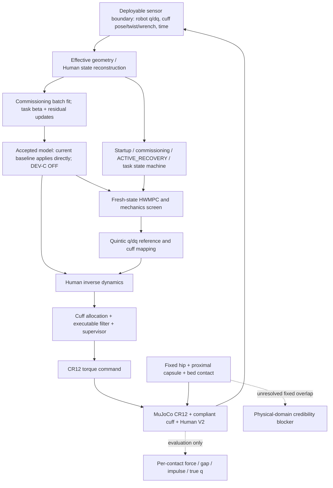

# Current baseline and audited physical boundary

The diagram describes the explicitly selected local DEV-A baseline, not a new
validated controller. No Human truth, contact force or geometry diagnostic
flows back into O/E/P/U. The fixed hip is attached to world; the bed is an
unchanged infinite plane; the proximal thigh capsule sphere center remains at
the fixed hip under all Human q. Changing hip placement relative to that plane
can therefore change unavoidable overlap before any command is executed.

The timing-aware runner measures planner latency and replays physical wait
intervals under the previous reference. This is controlled synchronous delay
replay, not asynchronous hardware real time. This diagnostic campaign uses
saved wait durations for repeatability and does not requalify runtime.
