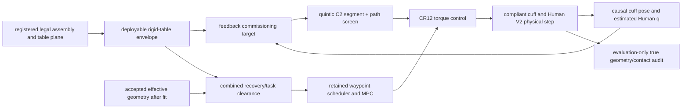

# DEV-D design and causal change record

## Causal question and answer supported before modification

The retained assembly repair made the initial fixed hip/thigh geometry legal,
but did not certify a trajectory. The evaluation-only boundary audit in
`results/.../rigid_table_reference_repair_v1/diagnosis/` re-evaluates the
requested `q_ref(t)` and measured true `q(t)` separately using each hidden
case's physical geometry. This is a diagnostic, not a production input.

For `balanced_middle_r01`, the old requested shank first crossed the table at
2.535 s (−0.0944 mm) while the actual shank was still +0.2404 mm; actual
shank contact followed at 2.540 s. That is an upstream requested-path defect
(A), irrespective of later tracking error. For
`balanced_near_upper_current_rom_r02`, actual sleeve clearance first became
slightly negative at 0.030 s, long before the old requested shank first became
negative at 2.325 s. This is a separate initial-support/physical execution
effect (C) in addition to the later old reference defect. The sleeve collider
is disabled in MuJoCo contact; its analytic overlap must be reported without
claiming a sleeve contact force.

## Production data flow

The new module is `src/traction_mpc_stage5/full3d_adaptive_integration_v1/
rigid_table_reference.py`. `RigidTableReferenceEnvelopeV1.margins` computes
signed table-top distances for the fixed proximal-thigh installation bound,
conservative distal shank, calibrated sleeve, cuff bar and adapter. The
full-assembly initial screen remains `rigid_table_assembly_v1.assess_assembly`.
The table plane, collider radii and tool dimensions are imported from the
existing plant/geometry definitions. The proximal bound is the positive
installation gap guaranteed by the versioned assembly screen in the
registered nonnegative sagittal q1 quadrant. It is **not** read from hidden
case geometry or inferred from a single fitted effective hip coordinate.
The effective hip is control-effective and must not be interpreted as a
certified anatomical thigh collider position.

For a quintic `q(s)=sum_i c_i s^i`, `s=t/T`, the checker samples 1201 nodes
and subtracts a derivative-root Lipschitz half-cell bound from each minimum.
Thus a sampled positive gap alone is not reported as continuous clearance.
The conservative shank length upper prior is 0.46 m and the inherited shank
margin is 1 mm. The checker assumes the current registered sagittal geometry
and a fixed table plane; it does **not** certify articulated CR12 link motion
or excluded collision pairs. Physical traces and evaluation-side link checks
remain necessary.

Before the multi-pose fit, `choose_feedback_commissioning_target` uses the
prior geometry, fresh deployable estimated q, the previously emitted reference
as a C2 origin, and the old prescribed waypoint difference. It first tries
the intended step, then explicit fractions 0.75/0.5/0.25, and if needed a
minimal hip-up correction found by bounded bisection. Every accepted target
is rechecked against the unchanged ROM, velocity, acceleration and geometric
path constraints. The final return does not silently truncate its target;
infeasibility is recorded and aborts. A narrowly defined prior-conservative
shank escape can accept a segment whose upper-length prior marks its origin
already below zero **only** when q1 and shank angle are monotone upward in the
registered quadrant, all other body envelopes are clear, and the shank lower
bound strictly improves. This exception is logged per selected segment. It
does not apply to recovery/task.

`run_executed_case` uses this mode only when explicitly enabled with DEV-A
recovery and timing-aware development execution; formal qualification rejects
it. While a new segment is computed, the old reference remains active and
MuJoCo advances under the controlled planning-delay replay. A plan older
than 100 ms is rejected. Fresh measured cuff position/orientation provide a
separate causal sleeve-gap check every commissioning control boundary;
penetration aborts without using true Human q. The already accepted effective
geometry feeds `CombinedRigidTableClearanceV1` after commissioning. That
object retains the previous session shank clearance **and** intersects it
with the new envelope for recovery, task entry, HOLD and RETURN candidate
screening. The task cost, candidate set and dynamics/adaptation remain
unchanged. True Human state and native contact forces are evaluation-only.

An initial broad replay exposed an Auditor-identified gap: the retained
scheduler's sampled path could use a *negative* clearance floor if a
registered endpoint was itself predicted below the table, and only its 5 ms
reference nodes (not the intervals) were checked. The versioned strict DEV-D
mode now clamps that floor to zero and requires
`CombinedRigidTableClearanceV1.certified_minimum` for each accepted quintic,
including fixed-duration recovery and duration-searched task schedules. It
reuses the same 1201-node derivative-root bound as commissioning. The
constructor enforces sharing of geometry, upper shank length and 1 mm shank
margin between retained and new components, so the distal-shank certificate
also covers the inherited shank contract. This extra strictness changes the
feasible set only for explicit DEV-D runs; the default historical scheduler
is left unchanged.

## Change isolation and limitations

DEV-D modifies reference selection, path checking and logging, not geometry
fitting, beta/residual laws, HWMPC cost, CR12/cuff/Human dynamics, contact
parameters, ROM, force/moment/acceleration limits, 100 ms deadline or value
hook. DEV-C remains off. No fixed path was forced through the table. No new
sensor or hidden simulator truth enters the deployable controller.

This is a conservative *predictive* geometry screen over the modeled Human
and tool envelope, not a comprehensive collision proof. The sleeve and
cuff-bar collision pairs remain disabled in the physical plant; articulated
robot links are not checked by this production envelope; and an actual
narrow-gap sleeve can cross the table despite a feasible planned Human path.
That latter event is classified as execution/initial support, not concealed by
increasing an arbitrary safety margin after the outcome. The continuous
certificate applies to the analytical envelope and constant geometry during
a schedule; it does not guarantee the coupled physical plant tracks it.
