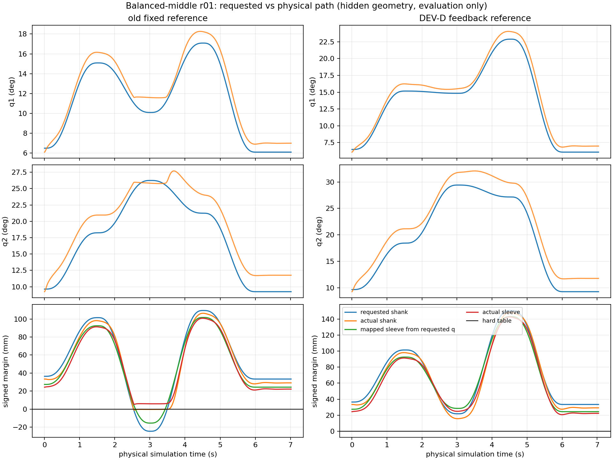
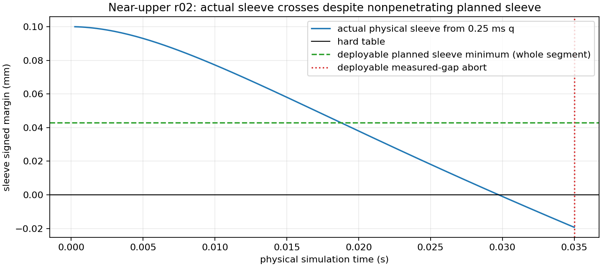

# DEV-D representative development evidence

All trajectories below are coupled CR12 actuator → physical cuff → Human V2
MuJoCo runs with timing-aware planning-delay replay. Hidden Human geometry/q
are used **only after the run** for the analytic signed-gap audit. The
production controller uses estimated q, measured cuff pose and a prior or
accepted effective geometry. These are consumed development cases, not fresh
held-out evidence or exact matched-state branches.

The figure uses the physical hidden geometry to evaluate `q_ref` and true q
at the same 5 ms boundaries. “Mapped sleeve from requested q” is an
evaluation-side geometric mapping; commissioning did not save a separately
defined desired cuff-pose trace, so it must not be misread as a deployable
controller variable.

| Case | Old assembly-only controller | Final strict DEV-D | First mechanism and interpretation |
|---|---|---|---|
| `balanced_middle_r01` | COMPLETE, but requested shank first negative at 2.535 s and actual at 2.540 s; old minimum requested/actual shank −24.434/−0.993 mm | Commissioning and recovery succeed; requested/actual shank minima +21.805/+15.685 mm, sleeve minima +24.418/+20.573 mm; task later aborts `STALE_PLAN_MAXIMUM_AGE` | The old requested Human path is physically impossible on the hard table (A). New path removes that mechanism; a separate runtime tail remains. |
| `balanced_ordinary_r01` | `NO_FEASIBLE_WAYPOINT` in task | Final strict DEV-D COMPLETE; positive requested/actual shank/sleeve trajectory, no native thigh/shank contact | Feasible commissioning can change downstream state sufficiently for a former task-feasibility failure to complete; this is a development comparison, not a controlled proof of all adaptation effects. |
| `balanced_near_upper_current_rom_r02` | V2 sleeve initially +0.1 mm, but actual sleeve first negative at 0.030 s and reached −3.132 mm; old requested shank did not first go negative until 2.325 s | First planned segment has conservative sleeve lower +0.042921 mm; physical sleeve crosses zero around 0.030 s and causal measured sleeve is −0.017875 mm at the 0.035 s abort; 140 native 0.25 ms physical intervals executed | This is a C-type physical execution/initial-support divergence **before** the later old reference defect. The sleeve contact pair is disabled, so it is analytic overlap, not a measured sleeve contact force. The new segment does not request sleeve penetration, but its initial margin is extremely narrow. |
| `balanced_near_upper_current_rom_r01` | Physically commissioned and entered task, then aborted | Final strict DEV-D commissions, fits, recovers and enters task, then aborts on registered task-velocity/deadline limit depending on host-timing replay | Reference feasibility does not establish task control robustness. The different abort categories across versioned repeats are retained, not merged. |
| `nominal_reference_rigid_table_v1` | Prior assembly-only nominal COMPLETE | Strict DEV-D commissions and recovers, but during RETURN aborts on the retained deployable `SESSION_CLEARANCE_LIMIT`; evaluation-only true shank remains positive, and physical sleeve reaches a very narrow +0.015837 mm sampled gap during commissioning | The old conservative session clearance, not a true shank collision, binds in this run. This is a real task-outcome regression and prevents a blanket “improved controller” claim. |

The near-upper plot uses every saved native 0.25 ms physical q sample through
abort. The horizontal green line is the full planned segment's *minimum*
deployable analytical sleeve lower bound, not a time-varying requested path.
At 0.035 s, the independently evaluated physical gap is about −0.0193 mm;
the causal measured-pose guard reports −0.017875 mm. The small difference is
the distinct physical-geometry versus measured-pose computation, not a
controller oracle correction.

The four physically completed commissioning episodes in the final five-case
representative package accepted their multi-pose geometry fits and reached
ACTIVE_RECOVERY. In the old/new middle comparison, the observed geometry-fit
angular span rose from 0.204799 to 0.228875 rad, sample count from 352 to
353, and fit condition number fell from 1466.0 to 559.1. This establishes
useful excitation in that case, not anatomical identification or convergence.
The early sleeve-abort case contributes no fitted-model success claim.

Exact per-case artifacts are in `results/full3d_adaptive_integration_v1/
rigid_table_reference_repair_v1/representative_strict_v1/` and
`broad_strict_v1/`; time-aligned post-run geometry diagnostics are in its
`diagnosis/` directory. The old sources are the preserved `rigid_table_assembly_repair_v1/
broad_old24_valid_v1/` and `supplemental_v2/` runs.
