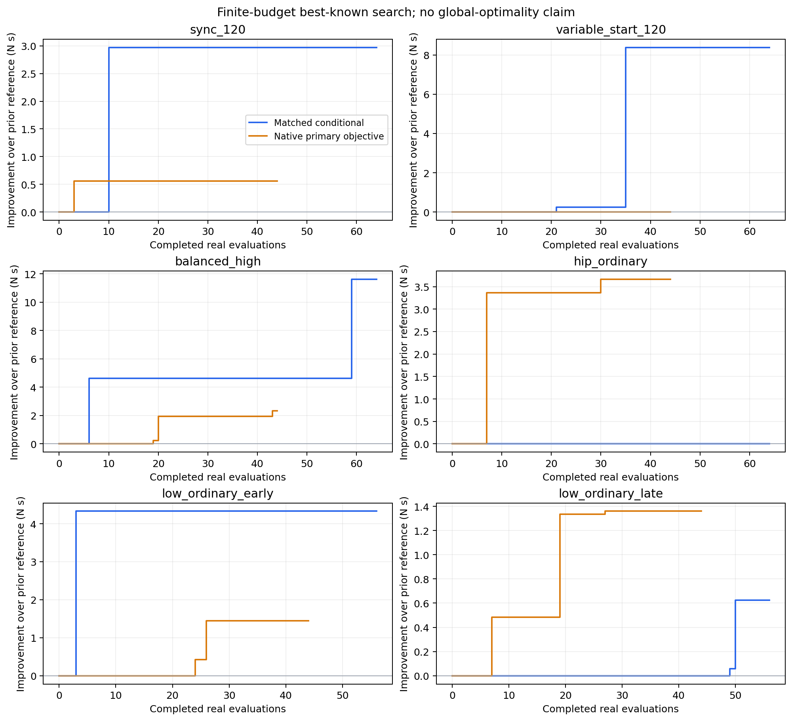
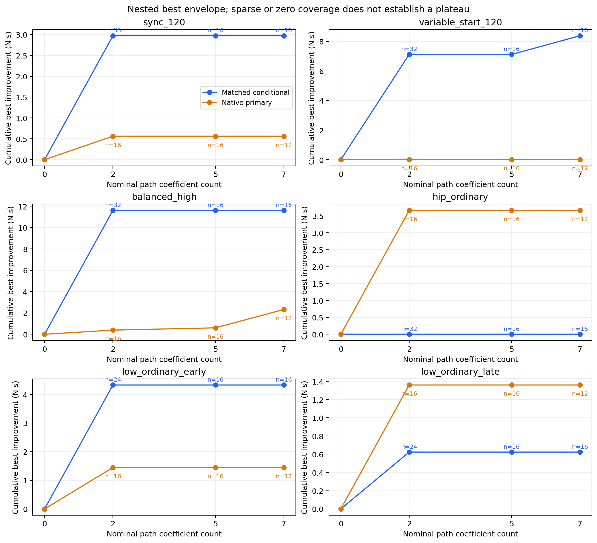
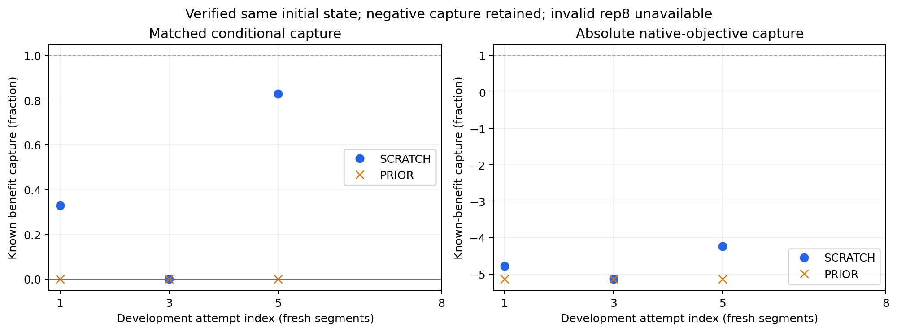

# Learning Research v1：性能上限、学习效率与在线计算

生成时间：2026-09-30T21:34:31.866433+00:00。当前状态：`VALUE_LEARNING_RESEARCH_V1_BLOCKED`，科学工作状态：`COMPLETED_BOUNDED_STUDY_WITH_NATIVE_CONTINUITY_BLOCKER`。

累计运行 7.46 小时；9 小时上限为 2026-09-30T23:07:00+00:00。新研究已关闭记录 858 个：{"VALID": 711, "INFEASIBLE": 128, "INVALID": 11, "INTERRUPTED_HOST_RESOURCE": 8}。历史 518 次探索、63.77 GB 原始来源另行冻结验证，不计为本轮新增实验。

主指标为完成有效任务的实测袖套力模积分 J_F_task，单位 N·s。安全与任务有效性始终为硬门槛；均值/RMS/峰值力、力矩积分/峰值、时长、clearance 和 smoothness 分别保存于逐次结果，不重新加权成奖励。

**必须区分两种范围：** NATIVE_SCHEDULER 是主目标的绝对 best-known 搜索；MATCHED 是固定声明续行时长的条件化学习研究。MATCHED 取得的改善不能当作绝对性能上限。所有参考均为 best-known，未证明全局最优。

## 1. 接口是否复现已知有益协调？

是。四个 MATCHED 和四个 NATIVE 参考通过同一研究候选/执行接口复放，目标、实现 q、力轨迹和 J_F 差异均为零。来源包含同步、变起点、balanced-high 和 hip 条件；原始控制、安全、估计与几何屏障保留。见 ACTION_EXPRESSIVITY_GATE.json 与 NATIVE_ACTION_EXPRESSIVITY_GATE.json。

## 2. 更强搜索是否超过旧 best-known？

下表旧值取全部历史 VALID 路径的最小成本，包括时序存在差异的路径；另外保留旧 timing-isolated 值，避免把受限旧参考当作绝对旧最优。Q 筛选新增参考与 CEM 搜索分开标注。

|条件|MATCHED 旧 → 新 (N·s)|NATIVE 旧 → 新 (N·s)|新增实测评估 matched/native|
|---|---:|---:|---:|
|sync_120|1488.972118 → 1468.421258|1180.562198 → 1180.000018|64/44|
|variable_start_120|1482.176759 → 1473.789827|1176.574504 → 1176.574504|64/44|
|balanced_high|1196.030462 → 1184.415952|938.997031 → 936.677211|64/44|
|hip_ordinary|756.721369 → 756.721369|621.738501 → 618.076149|64/44|
|low_ordinary_early|592.649264 → 588.319268|500.513571 → 499.067101|56/44|
|low_ordinary_late|588.414532 → 587.790992|501.390874 → 500.031160|56/44|

新赢家通过独立同起点再执行确认；这是确定性复现，不是独立受试者泛化。见 BEST_KNOWN_REFERENCE_CONFIRMATION.json、NATIVE_BEST_KNOWN_REFERENCE_CONFIRMATION.json。

## 3. 更多路径自由度是否继续降低成本？

variable_start_120 的 MATCHED 搜索包络从 L0 1482.176759、L2 1475.056402 降至 L3 1473.789827 N·s。但该 L3 赢家的两个新增系数为零，实际上仍可由 L2 表达。因此更大搜索确实继续改善，尚未证明额外自由度本身带来因果收益。L1/L2/L3 的连续系数分别为 2/5/7，另有离散 horizon/return 选择；各层评估数量不同，也不能当作公平复杂度消融。其他条件未必改善，L4 未执行。

## 4. 有证据接近平台吗？

不足。部分条件的有限预算包络变平，但有效评估、重启和代数覆盖不同，尚无充分重复优化或下界。CEM 保留基线、已知有益初始化、多个重启和均匀探索；每个提议使用真实冻结科学栈评价。见各条件 level_evaluations、restart_generation_evaluations、restart_best 和完整收敛曲线。

## 5. 最佳协调有多强的条件依赖？

明显。大 ROM 条件倾向较强 hip-leading H3；普通低 ROM 的最佳 MATCHED 路径包含小幅相反方向或不同 catch-up peak，hip 普通条件保留旧 H4 参考。NATIVE 与 MATCHED 最佳策略也不同。六个代表条件不支持单一跨条件最优策略或人群结论。

## 6. Q 能否正确排列动作？

数据为 503 条 VALID MATCHED 轨迹、6162 个实际激活决策、96 个可部署特征；train/validation/test 行数为 {'test': 1174, 'train': 3811, 'validation': 1177}。27 组共同状态、共同续行规则的安全下一目标分支支持局部排序识别。训练按条件隔离，未随机拆相邻轨迹行。

选定 FULL ridge 的 validation 平均 regret 0.684 N·s，legacy 1.690，ρ=0.417。held-out test ρ=-0.333、regret 3.555，对比 legacy 4.360；只支持有限的开发门槛，不能声称稳定跨条件正确排序。

Q 的实际语义是 Q(x,a | 已声明续行规则)，不是 Q*；每个目标从真实激活/生效区间计算 FULL 剩余回报与 1.5 秒 SHORT 回报。后续控制保持闭环，但本次策略先在首次 OUTBOUND 目标选择一个平滑续行模式，后续按该模式提议单个目标，不把整个 H3/H4 收益归因于孤立首个 waypoint。

## 7. FULL 是否胜过 SHORT？

结果混合，不能作一致优势结论。FULL ridge 比 SHORT ridge 的 held-out FULL 动作 regret 更低；MLP 则 SHORT 的 FULL 动作 regret 2.195 优于 FULL 8.335。不同目标的预测误差量级不可直接比较，主要比较共同分支中的实际完整回报 regret。未用 test 重新选择模型。

## 8. 简单模型与小 MLP 的效果？

|模型/目标|test MAE / RMSE (N·s)|FULL 动作排名 ρ|所选动作 regret (N·s)|top1 / top2|
|---|---:|---:|---:|---:|
|mlp_full|131.769 / 181.295|-0.000|8.335|0.500 / 0.500|
|mlp_short|15.789 / 20.517|0.333|2.195|0.667 / 0.667|
|ridge_full|81.488 / 113.239|-0.333|3.555|0.333 / 0.333|
|ridge_short|205.693 / 238.999|-1.000|8.556|0.000 / 0.000|

MLP 为两个 32 单元 tanh 层、NumPy Adam、三种冻结种子；ridge 含标准化线性项和可解释状态×动作交互。选模使用 validation；模型及 scaler 保存为不可变 NPZ。简洁 ridge 在本次 FULL 开发集较好，但 held-out 排名仍弱。

## 9. PRIOR 比 SCRATCH 帮助多少？

两者使用相同候选库、模型族、由离线 validation 选定的超参数。SCRATCH 无跨条件预训练值权重，初始两轮用已知安全的连贯提议；PRIOR 只用其他 train 条件，并排除当前 sync 与全部 held-out test，当前在线行单独记录。它们均不是从零学习控制器、任务、安全或候选族。

|会话|有效/尝试轮数|首轮 → 末轮 J_F (N·s)|收敛候选轮|
|---|---:|---:|---:|
|SCRATCH|4/8|1509.460 → 1478.874|None|
|PRIOR|4/8|1529.600 → 1529.600|None|

本轮连续启动失败后，后续有效尝试来自新的开发片段，并未保留连续 Human/adaptation 状态。PRIOR 的有效片段均选基线，未显示先验改善；SCRATCH 在第1/3/5/7次尝试的成本分别为1509.460/1529.600/1478.874/1478.874 N·s。它利用前两个已完成回报，在第三个有效片段（第5次尝试）选中预先存在候选库中的0.15/H3。该有限冷起点选择结果不能当作连续个性化、完整从零学习或人群样本。共同起点对照仅在精确状态核验后计算，具体预测误差、排名、选择、失败和更新版本见 SCRATCH_VS_PRIOR_ANALYSIS.json。

## 10. 小试验几轮稳定？

- SCRATCH：首次回溯收敛候选=None；有效轮数=4。
- PRIOR：首次回溯收敛候选=None；有效轮数=4。

稳定性同时检查同一连续片段内最近三次有效任务的 baseline-adjusted 收益、精确模式、Q 排名、目标替代探针、安全和计算门槛。本轮未得到这种连续窗口，因此没有收敛触发。开发后冻结的数值尺度仅为探索性诊断，尚未由连续学习数据校准。

## 11. 五轮收敛现实吗？

当前证据不支持五次连续重复收敛：原生续行启动失败，且第5次替代探针仍找到更优路径。见完整回溯准则与 rep1/3/5/8 的同轮替代探针。即使成本/模式平稳，若 Q 排名、替代动作改善、安全或计算门槛不满足，也不能认定收敛。八轮预算并非“5 learn + 25 exploit”；后续应前瞻冻结开发所得阈值并按证据停学。

## 12. Rep1/3/5/8 的已知收益捕获？

|会话/轮|MATCHED baseline / learned / reference (N·s)|条件化 capture|NATIVE 主目标 capture|
|---|---:|---:|---:|
|prior_v1/1|1529.600 / 1529.600 / 1468.421|0.000|-5.135|
|prior_v1/3|1529.600 / 1529.600 / 1468.421|0.000|-5.135|
|prior_v1/5|1529.600 / 1529.600 / 1468.421|0.000|-5.135|
|prior_v1/8|未测得 / 未测得 / 未测得|未测得|未测得|
|scratch_v1/1|1529.600 / 1509.460 / 1468.421|0.329|-4.782|
|scratch_v1/3|1529.600 / 1529.600 / 1468.421|0.000|-5.135|
|scratch_v1/5|1529.600 / 1478.874 / 1468.421|0.829|-4.245|
|scratch_v1/8|未测得 / 未测得 / 未测得|未测得|未测得|

capture=(baseline−learned)/(baseline−best-known)，仅正且可辨的分母计算。保留负值或超过 1 的结果；超过参考需独立确认后更新该状态 best-known。两种调度范围各用同轮前不可变检查点，不能把 MATCHED capture 当作绝对全局最优百分比。

## 13. 本轮最佳有效成本/参考是什么？

见上方逐条件表与 ABSOLUTE_PRIMARY_REFERENCE_TABLE.json；跨条件 J_F 不直接排序性能。sync 的后试验0.18/H3探针独立确认成本1468.421258 N·s，更新条件化 best-known；此前0.15/H3的1478.873547 N·s参考保留为初始冻结比较。NATIVE 参考明显更低，说明匹配时长学习问题仍有范围限制。各参考同时保存时长、相位差、参数、可行比例与原始实验 ID。

## 14. 学习器是否发现并确认更好行为？

离线 Q 在延迟采集中选择0.15/H3路径并独立确认1478.873547 N·s，低于 sync CEM 1485.999765；其train包含sync，不是held-out泛化。SCRATCH后续选到同一已知参考，未选择比它更好的路径；PRIOR未选中该路径。第5次的预声明替代探针0.18/H3得到1468.421258 N·s并独立确认，这是后试验探针的新发现，不能归为在线学习器的选择。本次最佳条件化参考因而更新，原参考capture另存。首次确认把嵌套配置误作为descriptor而实际复跑了基线，成本差异检查正确判FAIL并保留；随后使用原探针完整配置逐字复跑，差异为零。

## 15–19. 完整在线计算、瓶颈、更新与策略加速

### 在线计算与更新（问题 15–19）

以下是 Scientific Simulation 的实际主机剖析。模型属于固定 MATCHED pacing（1.3 倍注册段时长）和明确 continuation context；native 绝对目标补充研究未混入拟合。主机时间不会推进冻结的生产者仿真 epoch，因此这些数据不能认证硬件实时行为。

**15．端到端高层决策延迟是多少？**

| 范围 | 样本数 | 中位数 | p95 | p99 | 最大值 |
|---|---:|---:|---:|---:|---:|
| 原始传感捕获 → 参考验证完成 | 13 | 41.966 | 57.172 | 69.532 | 72.622 |
| 原始传感捕获 → 实际命令激活 | 13 | 42.381 | 57.654 | 69.947 | 73.020 |
| 研究决策开始 → 参考验证完成 | 12 | 40.051 | 55.605 | 66.436 | 69.143 |
| 研究决策开始 → 实际命令激活 | 12 | 40.433 | 56.080 | 66.849 | 69.542 |
| 首个特征开始 → 参考验证完成 | 12 | 30.992 | 42.964 | 51.245 | 53.316 |
| 首个特征开始 → 实际命令激活 | 12 | 31.374 | 43.439 | 51.659 | 53.714 |
| 选定参考 → 实际命令激活 | 12 | 30.685 | 34.084 | 34.744 | 34.910 |

单位：ms。

传感捕获早于 observation ready，故捕获到验证/激活是比所需观察就绪边界更宽的实际测量；特征边界采用同源绝对单调时间戳，缺失时保留“未测量”。适用样本数见表，p99 是样本分位数而非最坏时间证明。

此剖析未标记 snapshot 捕获 IO；正常运行的安全/任务有效性及模型 SHA 仍须由相应 rollout provenance 独立确认。

独立 capture 专用运行含 immutable snapshot 文件 IO，不能替代正常运行；配置也有差别，不能把两次运行的延迟差值解释为 IO 因果开销。该运行实际捕获 → 激活：

| 范围 | 样本数 | 中位数 | p95 | p99 | 最大值 |
|---|---:|---:|---:|---:|---:|
| capture 专用运行，额外 IO | 13 | 81.387 | 126.949 | 170.577 | 181.485 |

单位：ms。

观察到的角色延迟（排除明确标记的捕获 IO 运行）：

| 范围 | 样本数 | 中位数 | p95 | p99 | 最大值 |
|---|---:|---:|---:|---:|---:|
| 首个 pattern 选择：捕获 → 激活 | 1 | 73.020 | 73.020 | 73.020 | 73.020 |
| 已提交 continuation：捕获 → 激活 | 11 | 42.381 | 45.923 | 47.113 | 47.410 |
| 其中 moving handoff：捕获 → 激活 | 10 | 42.538 | 46.072 | 47.142 | 47.410 |

单位：ms。

**16．哪部分主导延迟？**

| 范围 | 样本数 | 中位数 | p95 | p99 | 最大值 |
|---|---:|---:|---:|---:|---:|
| 原始 planner 比较候选 | 12 | 0.000 | 2.716 | 5.371 | 6.035 |
| 继承 terminal/input guard 与 committed 原硬筛选 | 12 | 5.054 | 6.542 | 6.876 | 6.960 |
| 研究 proposal 枚举 | 12 | 0.170 | 0.455 | 0.701 | 0.762 |
| 研究候选调度/硬筛选 | 12 | 3.598 | 18.058 | 31.942 | 35.413 |
| 特征构建 | 12 | 0.060 | 0.157 | 0.222 | 0.238 |
| 批量 Q 推断和选择 | 12 | 0.049 | 0.065 | 0.075 | 0.078 |
| worker 完成到主线程收集 | 13 | 11.803 | 14.873 | 15.409 | 15.543 |
| 当前状态参考验证及命令构建 | 13 | 10.972 | 11.818 | 11.856 | 11.865 |

单位：ms。

adapter decision_total 的结束点是参考选择；它未覆盖 escape preparation、worker 主线程收集、当前状态参考验证和实际激活，不能称为端到端决策延迟。候选 feasibility/scheduling 的准入也不等于之后 activation validator 的许可。

按已测中位数，最大的上述组成项为 **worker 完成到主线程收集**。组件可能属于不同层级；不将各项 p95/p99 相加并冒充实际端到端分位数。

下面使用科学部署解释器的独立 CPU profile：Python 3.10.21，NumPy 2.2.6，线程设置 {'OMP_NUM_THREADS': '1', 'OPENBLAS_NUM_THREADS': '1', 'MKL_NUM_THREADS': '1'}。较早 abs_env/NumPy 1.23.5 profile 原样保留，未混合两种环境的分位数。

实际模型 SHA256：{"ridge_full": "39ebae5caeba2e433b8e01896aee37a03d7e51f7240977a3b486a338a0116c76", "mlp_full": "fc9450f5ed968b382da373cd7a05861e66e089bcc7b710cc9d9735cdee130863"}；冻结真实 X 文件 SHA256：4860a2bbe2ae9da23eadbfe6a390a77284117994bfccf031c2f30014051f2aff。

CPU ridge_full（真实冻结 96 维 X、实际已训练模型）：

| batch 候选数 | 首次调用 ms | warm 中位 ms | warm p95 ms | warm p99 ms | warm 最大 ms |
|---:|---:|---:|---:|---:|---:|
| 1 | 0.108 | 0.011 | 0.012 | 0.024 | 0.056 |
| 4 | 0.068 | 0.012 | 0.014 | 0.021 | 0.027 |
| 8 | 0.058 | 0.013 | 0.018 | 0.054 | 0.124 |
| 10 | 0.065 | 0.014 | 0.017 | 0.030 | 0.054 |
| 16 | 0.081 | 0.015 | 0.018 | 0.026 | 0.096 |
| 32 | 0.127 | 0.019 | 0.022 | 0.033 | 0.059 |

batch 8：CPU 输入复制 p95 0.001 ms；逐候选不批处理总推断中位 0.084 ms。首次模型加载 1.822 ms。

CPU mlp_full（真实冻结 96 维 X、实际已训练模型）：

| batch 候选数 | 首次调用 ms | warm 中位 ms | warm p95 ms | warm p99 ms | warm 最大 ms |
|---:|---:|---:|---:|---:|---:|
| 1 | 0.049 | 0.009 | 0.010 | 0.016 | 0.024 |
| 4 | 0.087 | 0.012 | 0.014 | 0.022 | 0.034 |
| 8 | 0.056 | 0.014 | 0.016 | 0.024 | 0.034 |
| 10 | 0.059 | 0.016 | 0.018 | 0.029 | 0.065 |
| 16 | 0.085 | 0.019 | 0.025 | 0.038 | 0.060 |
| 32 | 0.079 | 0.028 | 0.035 | 0.045 | 0.096 |

batch 8：CPU 输入复制 p95 0.001 ms；逐候选不批处理总推断中位 0.072 ms。首次模型加载 1.179 ms。

“首次调用”指加载后的该 batch 大小首次预测，不等于全进程冷启动。批处理/CPU 输入复制/逐候选开销均已分开保存。GPU 未测：本轮两类模型及训练实现均为 NumPy CPU 路径；不能推断 GPU 更快或更慢，也没有产生 GPU 传输数据。后台搜索负载可能造成离群值，原样保留。

**17．一次 repetition-boundary 更新需要多久？**

| 范围 | 样本数 | 中位数 | p95 | p99 | 最大值 |
|---|---:|---:|---:|---:|---:|
| 按模型 SHA/路径去重的实际模型生成 wall time | 8 | 0.004 | 0.007 | 0.007 | 0.007 |

单位：s。

共 8 个唯一在线模型生成任务；offline prior 初始化不计入，update_prepared、下一边界 promotion 和 final_prepared 的重复日志不重复计数。pending 事件 0，失败/拒绝事件 0。

SCRATCH 的实际在线模型生成：

| 范围 | 样本数 | 中位数 | p95 | p99 | 最大值 |
|---|---:|---:|---:|---:|---:|
| 唯一模型任务 | 4 | 0.002 | 0.002 | 0.002 | 0.002 |

单位：s。

PRIOR 的实际在线模型生成：

| 范围 | 样本数 | 中位数 | p95 | p99 | 最大值 |
|---|---:|---:|---:|---:|---:|
| 唯一模型任务 | 4 | 0.006 | 0.007 | 0.007 | 0.007 |

单位：s。

**18．学习/更新会阻塞连续执行吗？**

活动模型在任务内保持不变；后台生成新版本，校验后仅在明确安全 repetition boundary 切换。模型未就绪时保留既有验证版本。model readiness wait 上限为 2 s；这不是整个 inter-repetition 延迟上限。返回提取、checkpoint、文件归档，以及单列的安全边界/下一次运行初始化也有成本。最终 pool.shutdown(wait=True) 属于收尾，不能描述为部署延迟保证。

| 范围 | 样本数 | 中位数 | p95 | p99 | 最大值 |
|---|---:|---:|---:|---:|---:|
| 科学 harness 的 inter-rep processing | 16 | 5.953 | 12.004 | 12.063 | 12.078 |

单位：s。

预算来源：5 ms 是原控制/采样周期，不是 learner deadline；已选 waypoint 通常持续远长于该周期。原 moving endpoint 有 40 ms bridge，并在观察到的 35 ms 已认证 fork 前决定接入主参考或不可逆制动；原始 source age 必须严格小于 100 ms。初始静止 OUTBOUND 首决策与 moving continuation 应分别分析。

本轮连续执行验证失败：最终状态 `COMPLETE_ATTEMPT_BUDGET_NATIVE_CONTINUITY_FAILED`。SCRATCH 和 PRIOR 各用完 8 次尝试，其中各 4 次 VALID、4 次启动拒绝；VALID 来自尝试 1/3/5/7 的独立新 development segment，不能写成连续 8 个有效 repetition。模型就绪和 boundary promotion 发生过，并未证明后继 episode 能启动。失败尝试不进入正收益或低代价 return。

只读原始边界诊断：SCRATCH 尝试 2 在 29.605 s 通过旧参考静止门，随后原 fresh-epoch bootstrap 保留上一命令 5 ms、再执行注册起点 TRACK 5 ms；参考从 [5.5°,9.5°] 切为 [5°,10°]。到 29.615 s，新 start_episode 检查的估计 dq=[0.040139,0.040864] rad/s，均超过原 2°/s（0.034907 rad/s），truth hip dq=0.035112 也超限。位置仍在原 1° 容差内；observer 及 belief 1303 被保留，拒绝前 planner decision 数为 0。证据支持原跨 epoch bootstrap/settling 不兼容，未通过隔离反事实证明参考跳变是唯一原因，也没有修改守卫。

同一请求逐项计算的 moving 非 producer 跨度（capture → activation 减去该请求实际 producer compute，保留采集/收集/最终验证等开销）：

| 范围 | 样本数 | 中位数 | p95 | p99 | 最大值 |
|---|---:|---:|---:|---:|---:|
| moving 非 producer 实际配对跨度 | 10 | 27.337 | 29.103 | 29.156 | 29.170 |

单位：ms。

按其中已观察最大值，若其余开销保持现状，35 ms fork 留给 producer 的最小观察余量只有 5.830 ms。此余量不是 WCET 保证，也不是各组件分位数之和；它进一步说明仅有算法 max <35 ms 不能满足完整主机 moving 窗口。

当前计算门状态：`SCIENTIFIC_PILOT_COMPUTATION_PLAUSIBLE_WALL_BUDGET_UNDEMONSTRATED`；algorithm plausible-path=True；正常模型 rollout 验证=True；观察到的完整主机跨度均在对应机会内=False。原 epoch replay 不含实时队列、新观察 handoff 复验和实际写入，故算法预算可行不等于完整主机 deadline 达标。

所选配置为首决策实际 4 候选，captured BANK 来源索引 [0, 2, 3, 6]，后续一个已提交 continuation，legacy proposal limit=1。这是 development capture 的有界 proposal prior；原硬筛选保留，既有 baseline/fallback 仍为迟到结果的权威处理路径。

版本 v3 仅已提交 MATCHED continuation 延迟计算 legacy comparator：原 terminal/input guard 及 committed 候选 _evaluate 先执行，其结果复用于原 matched 硬筛选；候选拒绝时才调用原 legacy diagnostics 并保留原 research failure。初始/HOLD/native/branch 继续 eager。成功 continuation 的 comparator 未计算，日志 0 ms 表示未执行该阶段，不代表 baseline 的目标代价为零。原 escape 与 authority/epoch activation validator 未变。

实际移动 committed continuation 参考速度 [0.20943951023931934, 0.349065850398866] rad/s；算法原 epoch 验证重复测量如下：

| 范围 | 样本数 | 中位数 | p95 | p99 | 最大值 |
|---|---:|---:|---:|---:|---:|
| 实际 moving committed continuation 算法 | 30 | 19.591 | 20.426 | 20.820 | 20.953 |

单位：ms。

实际 moving 快照算法的进一步拆分（adapter 总计包含其 proposal、硬筛选、特征和 Q 项；不相加重复计数）：

| 范围 | 样本数 | 中位数 | p95 | p99 | 最大值 |
|---|---:|---:|---:|---:|---:|
| adapter 决策到选择 | 30 | 7.972 | 8.471 | 8.522 | 8.527 |
| 选择返回 → 已认证 escape preparation | 30 | 6.183 | 6.598 | 6.736 | 6.770 |
| 原 epoch activation validator | 30 | 5.265 | 5.523 | 5.631 | 5.672 |

单位：ms。

RETURN 冻结快照参考速度为 [0,0]，属于静止已提交 continuation 代理；保留其缩放数据，但不将其用于实际移动算法门。

真实冻结快照的算法缩放（每项 30 次；原 epoch 参考验证，失败项另存原始结果；不含完整实时激活链）：

| 范围 | 样本数 | 中位数 | p95 | p99 | 最大值 |
|---|---:|---:|---:|---:|---:|
| eager 保留 OUTBOUND captured BANK requested 1 / actual [1] / legacy default | 30 | 64.910 | 69.954 | 70.032 | 70.042 |
| eager 保留 OUTBOUND captured BANK requested 3 / actual [3] / legacy default | 30 | 82.315 | 93.785 | 104.123 | 107.639 |
| eager 保留 OUTBOUND captured BANK requested 4 / actual [4] / legacy default | 30 | 91.213 | 97.819 | 98.576 | 98.862 |
| eager 保留 OUTBOUND captured BANK requested 6 / actual [6] / legacy default | 30 | 110.381 | 116.690 | 118.616 | 119.393 |
| eager 保留 OUTBOUND captured BANK requested 10 / actual [10] / legacy default | 30 | 175.607 | 203.129 | 216.660 | 222.167 |
| eager 保留 OUTBOUND captured BANK requested 1 / actual [1] / legacy 1 | 30 | 30.945 | 33.131 | 37.284 | 38.930 |
| eager 保留 OUTBOUND captured BANK requested 3 / actual [3] / legacy 1 | 30 | 46.549 | 52.283 | 54.795 | 55.623 |
| eager 保留 OUTBOUND captured BANK requested 4 / actual [4] / legacy 1 | 30 | 56.795 | 66.361 | 73.132 | 74.952 |
| eager 保留 OUTBOUND captured BANK requested 6 / actual [6] / legacy 1 | 30 | 80.876 | 95.593 | 116.684 | 124.459 |
| eager 保留 OUTBOUND captured BANK requested 10 / actual [10] / legacy 1 | 30 | 115.537 | 122.257 | 123.485 | 123.771 |
| eager 保留 OUTBOUND captured BANK requested 1 / actual [1] / legacy 3 | 30 | 34.725 | 39.348 | 43.707 | 45.176 |
| eager 保留 OUTBOUND captured BANK requested 3 / actual [3] / legacy 3 | 30 | 55.988 | 62.661 | 65.699 | 66.272 |
| eager 保留 OUTBOUND captured BANK requested 4 / actual [4] / legacy 3 | 30 | 64.916 | 70.478 | 72.315 | 73.022 |
| eager 保留 OUTBOUND captured BANK requested 6 / actual [6] / legacy 3 | 30 | 83.061 | 90.859 | 92.915 | 93.646 |
| eager 保留 OUTBOUND captured BANK requested 10 / actual [10] / legacy 3 | 30 | 130.587 | 144.742 | 147.201 | 147.348 |
| eager 保留 RETURN captured BANK requested 1 / actual [1] / legacy default | 30 | 68.033 | 72.470 | 74.891 | 75.710 |
| eager 保留 RETURN captured BANK requested 3 / actual [1] / legacy default | 30 | 62.945 | 67.052 | 67.596 | 67.816 |
| eager 保留 RETURN captured BANK requested 4 / actual [1] / legacy default | 30 | 68.982 | 74.869 | 75.922 | 76.265 |
| eager 保留 RETURN captured BANK requested 6 / actual [1] / legacy default | 30 | 63.993 | 68.101 | 69.458 | 69.921 |
| eager 保留 RETURN captured BANK requested 10 / actual [1] / legacy default | 30 | 68.345 | 72.310 | 74.054 | 74.707 |
| eager 保留 RETURN captured BANK requested 1 / actual [1] / legacy 1 | 30 | 26.877 | 27.896 | 28.425 | 28.602 |
| eager 保留 RETURN captured BANK requested 3 / actual [1] / legacy 1 | 30 | 27.668 | 29.204 | 30.364 | 30.802 |
| eager 保留 RETURN captured BANK requested 4 / actual [1] / legacy 1 | 30 | 28.988 | 30.869 | 31.206 | 31.244 |
| eager 保留 RETURN captured BANK requested 6 / actual [1] / legacy 1 | 30 | 29.817 | 31.929 | 33.202 | 33.669 |
| eager 保留 RETURN captured BANK requested 10 / actual [1] / legacy 1 | 30 | 29.444 | 36.614 | 40.001 | 40.688 |
| eager 保留 RETURN captured BANK requested 1 / actual [1] / legacy 3 | 30 | 36.237 | 39.246 | 41.684 | 42.637 |
| eager 保留 RETURN captured BANK requested 3 / actual [1] / legacy 3 | 30 | 35.776 | 36.725 | 37.025 | 37.134 |
| eager 保留 RETURN captured BANK requested 4 / actual [1] / legacy 3 | 30 | 36.804 | 39.692 | 40.885 | 40.951 |
| eager 保留 RETURN captured BANK requested 6 / actual [1] / legacy 3 | 30 | 36.161 | 39.696 | 41.195 | 41.656 |
| eager 保留 RETURN captured BANK requested 10 / actual [1] / legacy 3 | 30 | 35.729 | 37.933 | 39.294 | 39.769 |
| eager 保留 OUTBOUND subset [0, 2, 3, 9] requested 4 / actual [4] / legacy 1 | 30 | 51.052 | 55.794 | 56.294 | 56.459 |
| eager 保留 OUTBOUND subset [0, 2, 3, 6] requested 4 / actual [4] / legacy 1 | 30 | 50.637 | 55.601 | 56.094 | 56.148 |
| eager 保留 OUTBOUND captured BANK requested 1 / actual [1] / legacy 1 | 30 | 27.975 | 31.997 | 35.491 | 36.773 |
| lazy v3 OUTBOUND captured BANK requested 4 / actual [4] / legacy 1 | 30 | 52.191 | 56.069 | 56.590 | 56.614 |
| lazy v3 OUTBOUND captured BANK requested 1 / actual [1] / legacy 1 | 30 | 19.591 | 20.426 | 20.820 | 20.953 |

单位：ms。

RETURN 已提交 continuation 实际始终为一个候选；requested BANK 大小不代表该状态执行了同等候选数。首决策完整 10 个候选加 legacy1 的最大耗时超过 100 ms，因此不能用它宣称当前预算可行。所选四候选保留实际 development 已选优 descriptor，而不是未经测量地固定 prefix4。

协议偏差已保留：SCRATCH rep1 物理状态 VALID，但执行时使用后来被取代的静止 continuation proxy gate，不能追溯标为 actual-moving v3 gate PASS。该次日志在 NumPy 边界 JSON 序列化处失败，原 repetition、checkpoint 和 gate publication 保留。原 checkpoint 的验证恢复不重置物理状态；rep2+ 的 lazy 计算修订在边界另行冻结，构成混合计算版本。随后原连续启动失败结束该 segment，后续 VALID 是另行标记的新 segment，不能将这些重新初始化解释为连续物理状态。

**19．显式候选搜索 + Q 排序够快吗，是否需要 actor/distillation？**

本轮优先依据实际正常运行与候选数缩放选择有限的多样首决策 proposal，以及后续一个已提交 continuation candidate。单候选 continuation 已不能继续通过减少研究候选数解决成本。若 Q 推断很小而硬筛选、原始候选比较、escape preparation、主线程收集或最终验证占主要时间，单纯增加 actor 不能解决这些成本。只有实际完整决策证据持续超出机会、且 proposal 数缩减仍不足时，再评价轻量 proposal policy，随后仍执行原有硬筛选；当前证据更支持先剖析这些调度/验证开销，不自动启动 actor。

`RUNTIME_ASSURANCE_REQUIRED_BEFORE_HARDWARE_EXPERIMENTS`。以上不构成硬件安全、WCET 或实时资格。

## 20. 下一次更大实验具体用什么方法？

推荐“续行一致的原生调度模板＋版本化轻量 ridge critic”这一方法。先在独立开发版本验证接受终点到下一轮起点的参考连续性/安全桥接，保留原始1°/2°s启动门槛；再保留 NATIVE 基线作实际 fallback/incumbent，用少量连贯安全模板提议下一 hip/knee 目标，原始安全筛选后独立 Q 排名，已承诺续行复用已验证筛选。原生调度数据必须有共同状态/共同续行分支对照并通过新的 held-out 排名、主目标收益与完整提交链预算验证；安全轮边界切换模型，rep1/3/5/8 前瞻冻结探针和收敛准则。验证完成后才进入更大的 learn-until-converged → exploit 研究。本轮不启动最终30轮、硬件或 realtime qualification。

这是一个下一步方法，包含必需的原生主目标与提交链验证门槛；当前 MATCHED critic 不能直接晋升为部署策略。推理已很快，优先削减重复安全计算和提交开销；只有少量候选仍无法满足预算时，才考虑轻量 proposal policy，安全筛选继续权威。

## 证据、修复与 Git 状态

SCRATCH rep1 的物理任务有效，但在后来被撤销的静止续行代理门槛下提前执行，构成计算门槛的流程偏差。该轮保留，不追认成真实运动门槛通过；后续轮只能在单独冻结并复测的计算版本通过科学门槛后，从原始检查点安全边界恢复。见 PILOT_PROTOCOL_DEVIATIONS.json 与 boundary_computation_amendment_v3.json。不同计算版本不能合并成一份部署实时通过证据。
起点分支 codex/coordination-pacing-exploration-v1，HEAD 8654cf0b6704fdecce3b4ccf1f00eb599aa5248c；研究分支 codex/value-learning-research-v1。原始控制/估计/Human dynamics/历史证据哈希保持冻结；hidden truth 仅评估使用，未进入选择。科学运行管线记录 6 次有界修订，逐项见修复与基础设施记录。收尾核验工具的首次实现路径解析与读取缓冲修正另存于 FINAL_VERIFICATION_METHOD_NOTES.json，未追加科学再实验或控制/安全修订。

本轮改动位于新研究 scripts/value_learning_v1 与 docs/value_learning_research_v1，另新增 git-ignore 规则；大型原始轨迹忽略于 Git，lossless 压缩及 D 盘逐字节校验转存有清单/哈希。未 reset、stash、clean、merge、force push 或 git add -A。所有分阶段提交逐文件 stage。

RAW_DATA_MANIFEST.json、FINGERPRINTS.json、SOURCE_RAW_VERIFICATION.json、FINAL_EVIDENCE_VERIFICATION.json、Git checkpoint/REMOTE_VERIFICATION 记录用于复现。总时间与逐类别 launch 耗时见 REFERENCE_AND_TRAINING_WALL_TIME.json；并发工作时间求和不是经过的 wall time。

Git push 的自动审批已拒绝，理由是 GitHub 目的地/外发研究载荷授权未获确认。先完成可审查科学证据与本地提交，最后向用户请求向 https://github.com/Block-O2/adaptive-traction-mpc 的 codex/value-learning-research-v1 分支推送。未验证 local HEAD == remote HEAD 前，不宣称用户要求的整体 COMPLETE。

`RUNTIME_ASSURANCE_REQUIRED_BEFORE_HARDWARE_EXPERIMENTS`。科学算法耗时、冻结物理仿真和确定性复现均不构成硬件实时或临床安全资格。

## 实测结果图表

CEM 曲线仅包含搜索评估，不包含后续 Q 选择或替代探针的新发现。复杂度曲线为累计 best-known 包络，各层覆盖不等；收益捕获图的有效点来自新开发片段，未连成连续学习曲线。

最终证据核验：PASS；核验 858 个 rollout、13938 个文件，耗时 2240.422 s。
